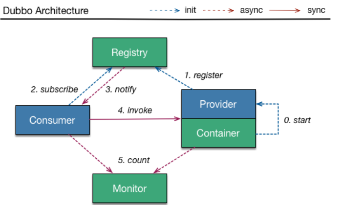

# SpringCloud学习笔记_V1

## 一、工程环境搭建

spring cloud版本：Dalston.SR1

spring boot版本：1.5.19.RELEASE

> ​	约定 > 配置 > 编码

### 1、构建父工程 spring-cloud-study-sgg-v1

#### 1、新建 Maven 工程 spring-cloud-study-sgg-v1

`pom.xml` 文件，其中 packaging 必须是 pom

```xml-dtd
<?xml version="1.0" encoding="UTF-8"?>
<project xmlns="http://maven.apache.org/POM/4.0.0"
         xmlns:xsi="http://www.w3.org/2001/XMLSchema-instance"
         xsi:schemaLocation="http://maven.apache.org/POM/4.0.0 http://maven.apache.org/xsd/maven-4.0.0.xsd">
    <modelVersion>4.0.0</modelVersion>

    <groupId>com.lcp.springcloud</groupId>
    <artifactId>spring-cloud-study-sgg-v1</artifactId>
    <version>1.0-SNAPSHOT</version>
    <packaging>pom</packaging>

    <properties>
        <project.build.sourceEncoding>UTF-8</project.build.sourceEncoding>
        <maven.compiler.source>1.8</maven.compiler.source>
        <maven.compiler.target>1.8</maven.compiler.target>
        <junit.version>4.12</junit.version>
        <log4j.version>1.2.17</log4j.version>
        <lombok.version>1.16.18</lombok.version>
    </properties>

    <dependencyManagement>
        <dependencies>
            <dependency>
                <groupId>org.springframework.cloud</groupId>
                <artifactId>spring-cloud-dependencies</artifactId>
                <version>Dalston.SR1</version>
                <type>pom</type>
                <scope>import</scope>
            </dependency>
            <dependency>
                <groupId>org.springframework.boot</groupId>
                <artifactId>spring-boot-dependencies</artifactId>
                <version>1.5.9.RELEASE</version>
                <type>pom</type>
                <scope>import</scope>
            </dependency>
            <dependency>
                <groupId>mysql</groupId>
                <artifactId>mysql-connector-java</artifactId>
                <version>8.0.19</version>
            </dependency>
            <dependency>
                <groupId>com.alibaba</groupId>
                <artifactId>druid</artifactId>
                <version>1.0.31</version>
            </dependency>
            <dependency>
                <groupId>org.mybatis.spring.boot</groupId>
                <artifactId>mybatis-spring-boot-starter</artifactId>
                <version>1.3.0</version>
            </dependency>
            <dependency>
                <groupId>ch.qos.logback</groupId>
                <artifactId>logback-core</artifactId>
                <version>1.2.3</version>
            </dependency>
            <dependency>
                <groupId>junit</groupId>
                <artifactId>junit</artifactId>
                <version>${junit.version}</version>
                <scope>test</scope>
            </dependency>
            <dependency>
                <groupId>log4j</groupId>
                <artifactId>log4j</artifactId>
                <version>${log4j.version}</version>
            </dependency>
        </dependencies>
    </dependencyManagement>

</project>
```

### 2、构建公共子模块 spring-cloud-study-api

#### 1、新建 Maven 工程 spring-cloud-study-api

`pom.xml` 文件

```xml-dtd
<?xml version="1.0" encoding="UTF-8"?>
<project xmlns="http://maven.apache.org/POM/4.0.0"
         xmlns:xsi="http://www.w3.org/2001/XMLSchema-instance"
         xsi:schemaLocation="http://maven.apache.org/POM/4.0.0 http://maven.apache.org/xsd/maven-4.0.0.xsd">
    <!-- 子类里面显示声明才能有明确的继承表现，无意外就是父类的默认版本否则自己定义 -->
    <parent>
        <artifactId>spring-cloud-study-sgg-v1</artifactId>
        <groupId>com.lcp.springcloud</groupId>
        <version>1.0-SNAPSHOT</version>
    </parent>
    <modelVersion>4.0.0</modelVersion>

    <!-- 当前Module我自己叫什么名字 -->
    <artifactId>spring-cloud-study-api</artifactId>

    <!-- 当前Module需要用到的jar包，按自己需求添加，如果父类已经包含了，可以不用写版本号 -->
    <dependencies>
        <dependency>
            <groupId>org.projectlombok</groupId>
            <artifactId>lombok</artifactId>
        </dependency>
    </dependencies>

</project>
```

#### 2、新建部门 Entity 并配合 Lombok 使用

```java
package com.lcp.springcloud.entities;

import lombok.AllArgsConstructor;
import lombok.Data;
import lombok.NoArgsConstructor;
import lombok.experimental.Accessors;
import java.io.Serializable;

@AllArgsConstructor
@NoArgsConstructor
@Data
@Accessors(chain = true)
public class Dept implements Serializable { // 必须序列化
    /**
     * 主键
     */
    private Long deptno;

    /**
     * 部门名称
     */
    private String dname;

    /**
     * 来自哪个数据库，因为微服务架构可以一个服务对应一个数据库，同一个信息被存储到不同数据库
     */
    private String db_source;

    public Dept(String dname) {
        super();
        this.dname = dname;
    }
}
```

#### 3、mvn clean，mvn install 

上述操作后给其它模块引用，达到通用的目的，其它模块需要用到部门实体的话，不用每一个工程都定义一份，直接引用本模块即可。

### 3、构建部门微服务提供者模块 spring-cloud-provider-dept-8001

#### 1、新建 Maven 工程 spring-cloud-provider-dept-8001

`pom.xml` 文件

```xml-dtd
<?xml version="1.0" encoding="UTF-8"?>
<project xmlns="http://maven.apache.org/POM/4.0.0"
         xmlns:xsi="http://www.w3.org/2001/XMLSchema-instance"
         xsi:schemaLocation="http://maven.apache.org/POM/4.0.0 http://maven.apache.org/xsd/maven-4.0.0.xsd">
    <parent>
        <artifactId>spring-cloud-study-sgg-v1</artifactId>
        <groupId>com.lcp.springcloud</groupId>
        <version>1.0-SNAPSHOT</version>
    </parent>
    <modelVersion>4.0.0</modelVersion>

    <artifactId>spring-cloud-provider-dept-8001</artifactId>

    <dependencies>
        <!-- 引入自己定义的 api 通用包，可以使用 Dept 部门 Entity -->
        <dependency>
            <groupId>com.lcp.springcloud</groupId>
            <artifactId>spring-cloud-study-api</artifactId>
            <version>${project.version}</version>
        </dependency>
        <dependency>
            <groupId>junit</groupId>
            <artifactId>junit</artifactId>
        </dependency>
        <dependency>
            <groupId>mysql</groupId>
            <artifactId>mysql-connector-java</artifactId>
        </dependency>
        <dependency>
            <groupId>com.alibaba</groupId>
            <artifactId>druid</artifactId>
        </dependency>
        <dependency>
            <groupId>ch.qos.logback</groupId>
            <artifactId>logback-core</artifactId>
        </dependency>
        <dependency>
            <groupId>org.mybatis.spring.boot</groupId>
            <artifactId>mybatis-spring-boot-starter</artifactId>
        </dependency>
        <dependency>
            <groupId>org.springframework.boot</groupId>
            <artifactId>spring-boot-starter-jetty</artifactId>
        </dependency>
        <dependency>
            <groupId>org.springframework.boot</groupId>
            <artifactId>spring-boot-starter-web</artifactId>
        </dependency>
        <dependency>
            <groupId>org.springframework.boot</groupId>
            <artifactId>spring-boot-starter-test</artifactId>
        </dependency>
        <!-- 修改后立即生效，热部署 -->
        <dependency>
            <groupId>org.springframework</groupId>
            <artifactId>springloaded</artifactId>
        </dependency>
        <dependency>
            <groupId>org.springframework.boot</groupId>
            <artifactId>spring-boot-devtools</artifactId>
        </dependency>
    </dependencies>
    
</project>
```

#### 2、application.yaml

```yaml
server:
  port: 8001

mybatis:
  config-location: classpath:mybatis/mybatis.cfg.xml        # mybatis配置文件所在路径
  type-aliases-package: com.atguigu.springcloud.entities    # 所有Entity别名类所在包
  mapper-locations:
    - classpath:mybatis/mapper/**/*.xml                       # mapper映射文件

spring:
  application:
    name: microservicecloud-dept
  datasource:
    type: com.alibaba.druid.pool.DruidDataSource            # 当前数据源操作类型
    driver-class-name: com.mysql.cj.jdbc.Driver              # mysql驱动包
    url: jdbc:mysql://localhost:3306/cloudDB01              # 数据库名称
    username: root
    password: 123456
    dbcp2:
      min-idle: 5                                           # 数据库连接池的最小维持连接数
      initial-size: 5                                       # 初始化连接数
      max-total: 5                                          # 最大连接数
      max-wait-millis: 200                                  # 等待连接获取的最大超时时间
```

#### 3、mybstis.cfg.xml

模块 `src/main/resources/mybatis` 目录下新建 `` 

```xml
<?xml version="1.0" encoding="UTF-8" ?>
<!DOCTYPE configuration
        PUBLIC "-//mybatis.org//DTD Config 3.0//EN"
        "http://mybatis.org/dtd/mybatis-3-config.dtd">

<configuration>

    <settings>
        <setting name="cacheEnabled" value="true"/><!-- 二级缓存开启 -->
    </settings>

    <typeAliases>
        <!--默认名称：指定包下 JavaBean 的非限定类名-->
        <package name ="com.lcp.springcloud" />
    </typeAliases>

</configuration>
```

#### 4、运行创建部门数据库脚本

```sql
DROP DATABASE IF EXISTS cloudDB01;
CREATE DATABASE cloudDB01 CHARACTER SET UTF8;
USE cloudDB01;
CREATE TABLE dept
(
  deptno BIGINT NOT NULL PRIMARY KEY AUTO_INCREMENT,
  dname VARCHAR(60),
  db_source   VARCHAR(60)
);
 
INSERT INTO dept(dname,db_source) VALUES('开发部',DATABASE());
INSERT INTO dept(dname,db_source) VALUES('人事部',DATABASE());
INSERT INTO dept(dname,db_source) VALUES('财务部',DATABASE());
INSERT INTO dept(dname,db_source) VALUES('市场部',DATABASE());
INSERT INTO dept(dname,db_source) VALUES('运维部',DATABASE());

SELECT * FROM dept;
```

#### 5、DeptDao 部门接口

```java
package com.lcp.springcloud.dao;

import com.lcp.springcloud.entities.Dept;
import org.apache.ibatis.annotations.Mapper;
import java.util.List;

@Mapper
public interface DeptDao {
    public boolean addDept(Dept dept);

    public Dept findById(Long id);

    public List<Dept> findAll();
}
```

#### 6、DeptMapper.xml

模块 `src/main/resources/mybatis/mapper` 目录下新建 `DeptMapper.xml` 

```xml
<?xml version="1.0" encoding="UTF-8" ?>
<!DOCTYPE mapper PUBLIC "-//mybatis.org//DTD Mapper 3.0//EN"
        "http://mybatis.org/dtd/mybatis-3-mapper.dtd">

<mapper namespace="com.lcp.springcloud.dao.DeptDao">

    <select id="findById" resultType="Dept" parameterType="Long">
   select deptno,dname,db_source from dept where deptno=#{deptno};
  </select>
    <select id="findAll" resultType="Dept">
   select deptno,dname,db_source from dept;
  </select>
    <insert id="addDept" parameterType="Dept">
   INSERT INTO dept(dname,db_source) VALUES(#{dname},DATABASE());
  </insert>

</mapper>
```

#### 7、DeptService 部门服务接口

```java
package com.lcp.springcloud.service;

import com.lcp.springcloud.entities.Dept;
import java.util.List;

public interface DeptService {
    public boolean add(Dept dept);

    public Dept get(Long id);

    public List<Dept> list();
}
```

#### 8、DeptServiceImpl 部门服务接口实现类

```java
package com.lcp.springcloud.service.impl;

import com.lcp.springcloud.dao.DeptDao;
import com.lcp.springcloud.entities.Dept;
import com.lcp.springcloud.service.DeptService;
import javax.annotation.Resource;
import java.util.List;

@Service
public class DeptServiceImpl implements DeptService {
    @Resource
    private DeptDao dao;

    @Override
    public boolean add(Dept dept) {
        return dao.addDept(dept);
    }

    @Override
    public Dept get(Long id) {
        return dao.findById(id);
    }

    @Override
    public List<Dept> list() {
        return dao.findAll();
    }
}
```

#### 9、DeptController 部门微服务提供者 REST

```java
package com.lcp.springcloud.controller;

import com.lcp.springcloud.entities.Dept;
import com.lcp.springcloud.service.DeptService;
import org.springframework.web.bind.annotation.*;
import javax.annotation.Resource;
import java.util.List;

@RestController
public class DeptController {
    @Resource
    private DeptService service;

    @RequestMapping(value="/dept/add",method= RequestMethod.POST)
    public boolean add(@RequestBody Dept dept) {
        return service.add(dept);
    }

    @RequestMapping(value="/dept/get/{id}",method=RequestMethod.GET)
    public Dept get(@PathVariable("id") Long id) {
        return service.get(id);
    }

    @RequestMapping(value="/dept/list",method=RequestMethod.GET)
    public List<Dept> list() {
        return service.list();
    }
}
```

#### 10、DeptProvider8001 启动类

```java
package com.lcp.springcloud;

import org.springframework.boot.SpringApplication;
import org.springframework.boot.autoconfigure.SpringBootApplication;

@SpringBootApplication
public class DeptProvider8001 {
    public static void main(String[] args) {
        SpringApplication.run(DeptProvider8001.class, args);
    }
}
```

#### 11、测试

启动该服务，在 Postman 使用以下地址进行测试

1. http://localhost:8001/dept/get/2

   ```json
   {
       "deptno": 2,
       "dname": "人事部",
       "db_source": "cloudDB01"
   }
   ```

2. http://localhost:8001/dept/list

   ```json
   [{"deptno":1,"dname":"开发部","db_source":"cloudDB01"},
    {"deptno":2,"dname":"人事部","db_source":"cloudDB01"},
    {"deptno":3,"dname":"财务部","db_source":"cloudDB01"},
    {"deptno":4,"dname":"市场部","db_source":"cloudDB01"},
    {"deptno":5,"dname":"运维部","db_source":"cloudDB01"}]
   ```

   > IDEA自带工具也可以进行测试：Tools -> Http Client -> Test RESTful Web Service
   >
   > 编写测试文件 `rest-api.http`
   >
   > ```http
   > GET http://localhost:8001/dept/list
   > Accept: application/json
   > 
   > ###
   > GET http://localhost:8001/dept/get/2
   > Accept: application/json
   > 
   > ###
   > ```

### 4、构建部门微服务消费者模块 spring-cloud-provider-consumer-80

#### 1、新建 Maven 工程 spring-cloud-provider-consumer-80

`pom.xml`

```xml
<?xml version="1.0" encoding="UTF-8"?>
<project xmlns="http://maven.apache.org/POM/4.0.0"
         xmlns:xsi="http://www.w3.org/2001/XMLSchema-instance"
         xsi:schemaLocation="http://maven.apache.org/POM/4.0.0 http://maven.apache.org/xsd/maven-4.0.0.xsd">
    <parent>
        <artifactId>spring-cloud-study-sgg-v1</artifactId>
        <groupId>com.lcp.springcloud</groupId>
        <version>1.0-SNAPSHOT</version>
    </parent>
    <modelVersion>4.0.0</modelVersion>

    <artifactId>spring-cloud-provider-consumer-80</artifactId>

    <dependencies>
        <!-- 自己定义的api -->
        <dependency>
            <groupId>com.lcp.springcloud</groupId>
            <artifactId>spring-cloud-study-api</artifactId>
            <version>1.0-SNAPSHOT</version>
        </dependency>
        <dependency>
            <groupId>org.springframework.boot</groupId>
            <artifactId>spring-boot-starter-web</artifactId>
        </dependency>
        <!-- 修改后立即生效，热部署 -->
        <dependency>
            <groupId>org.springframework</groupId>
            <artifactId>springloaded</artifactId>
        </dependency>
        <dependency>
            <groupId>org.springframework.boot</groupId>
            <artifactId>spring-boot-devtools</artifactId>
        </dependency>
    </dependencies>

</project>
```

#### 2、application.yaml

```yaml
server:
  port: 80
```

#### 3、ConfigBean

在 `com.lcp.springcloud.cfgbeans` 包下，类似于 spring 里面的 applicationContext.xml 编写的注入 Bean

```java
package com.lcp.springcloud.cfgbeans;

import org.springframework.context.annotation.Configuration;
import org.springframework.web.client.RestTemplate;

@Configuration
public class ConfigBean {
    
    @Bean
    public RestTemplate getRestTemplate() {
        return new RestTemplate();
    }
}
```

#### RestTemplate

RestTemplate提供了多种便捷访问远程Http服务的方法， 是一种简单便捷的访问restful服务模板类，是Spring提供的用于访问Rest服务的客户端模板工具集。

官网地址

https://docs.spring.io/spring-framework/docs/4.3.7.RELEASE/javadoc-api/org/springframework/web/client/RestTemplate.html

使用

使用 RestTemplate 访问 restful 接口非常的简单粗暴无脑，有三个主要参数

1. `url`：REST请求地址
2. `requestMap`：请求参数
3. `ResponseBean.class`：HTTP响应转换被转换成的对象类型

#### 4、DeptControllerConsumer

```java
package com.lcp.springcloud.controller;

import com.lcp.springcloud.entities.Dept;
import org.springframework.web.bind.annotation.*;
import org.springframework.web.client.RestTemplate;

import javax.annotation.Resource;
import java.util.List;

@RestController
@RequestMapping("/consumer")
public class DeptControllerConsumer {
    private static final String REST_URL_PREFIX = "http://localhost:8001";

    @Resource
    private RestTemplate restTemplate;

    @PostMapping("/add")
    public boolean add(@RequestBody Dept dept) {
        return restTemplate.postForObject(REST_URL_PREFIX + "/dept/add", dept, Boolean.class);
    }

    @GetMapping(value = "/get/{id}")
    public Dept get(@PathVariable("id") Long id) {
        return restTemplate.getForObject(REST_URL_PREFIX + "/dept/get/" + id, Dept.class);
    }

    @SuppressWarnings("unchecked")
    @RequestMapping(value = "/list", method = RequestMethod.GET)
    public List<Dept> list() {
        return restTemplate.getForObject(REST_URL_PREFIX + "/dept/list", List.class);
    }
}
```

> @SuppressWarnings 注解告诉编译器忽略指定的警告，不用在编译完成后出现警告信息。
>
> https://www.cnblogs.com/liaojie970/p/9009199.html

#### 5、DeptConsumerApp80 启动类

```java
package com.lcp.springcloud;

import org.springframework.boot.SpringApplication;
import org.springframework.boot.autoconfigure.SpringBootApplication;

@SpringBootApplication
public class DeptConsumerApp80 {
    public static void main(String[] args) {
        SpringApplication.run(DeptConsumerApp80.class, args);
    }
}
```

6、测试

启动服务进行测试，上一个服务也要启动

1. http://localhost:8001/dept/get/2

   结果同上

2. http://localhost:8001/dept/list

   结果同上

3. http://localhost/consumer/add

   ```
   true
   ```

IDEA rest-api.http

```http
GET http://localhost/consumer/list
Accept: application/json

###
GET http://localhost/consumer/get/2
Accept: application/json

###
POST http://localhost/consumer/add
Content-Type: application/json

{
    "dname": "Test3",
    "db_source": "cloudDB01"
}
```

## 二、Eureka

### 1、是什么

读音：[Eureka](https://translate.google.cn/#view=home&op=translate&sl=auto&tl=en&text=eureka)  美 [juˈriːkə] 

Eureka是Netflix的一个子模块，也是核心模块之一。Eureka是一个基于REST的服务，用于定位服务，以实现云端中间层服务发现和故障转移。服务注册与发现对于微服务架构来说是非常重要的，有了服务发现与注册，只需要使用服务的标识符，就可以访问到服务，而不需要修改服务调用的配置文件了。功能类似于dubbo的注册中心，比如Zookeeper。

Netflix 在设计 Eureka 是遵守 AP 原则

[CAP原则]([https://baike.baidu.com/item/CAP%E5%8E%9F%E5%88%99/5712863?fr=aladdin](https://baike.baidu.com/item/CAP原则/5712863?fr=aladdin)) 又称 CAP 定理，指的是在一个分布式系统中， Consistency（一致性）、 Availability（可用性）、Partition tolerance（分区容错性），三者不可得兼。

### 2、原理

#### Eureka 基本架构

Spring Cloud 封装了 Netflix 公司开发的 Eureka 模块来实现服务注册和发现（请对比 Zookeeper）。

Eureka 采用了 C-S 的设计架构。Eureka Server 作为服务注册功能的服务器，它是服务注册中心。

而系统中的其他微服务，使用 Eureka 的客户端连接到 Eureka Server 并维持心跳连接。这样系统的维护人员就可以通过 Eureka Server 来监控系统中各个微服务是否正常运行。SpringCloud 的一些其他模块（比如 Zuul）就可以通过 Eureka Server 来发现系统中的其他微服务，并执行相关的逻辑。（请注意和 Dubbo 的架构对比）




Eureka 包含两个组件：`Eureka Server` 和 `Eureka Client`
Eureka Server 提供服务注册服务，各个节点启动后，会在EurekaServer中进行注册，这样EurekaServer中的服务注册表中将会存储所有可用服务节点的信息，服务节点的信息可以在界面中直观的看到

EurekaClient 是一个 Java 客户端，用于简化 Eureka Server 的交互，客户端同时也具备一个内置的、使用轮询(round-robin) 负载算法的负载均衡器。在应用启动后，将会向 Eureka Server 发送心跳（默认周期为30秒）。如果Eureka Server 在多个心跳周期内没有接收到某个节点的心跳，Eureka Server 将会从服务注册表中把这个服务节点移除（默认90秒）。

#### 三大角色

1. Eureka Server ：提供服务注册与发现
2. Service Provider ：服务提供方，将自身服务注册到 Eureka Server，从而使服务消费方能够找到
3. Service Consumer ：服务消费方，从 Eureka Server 获取注册服务列表，从而能够消费服务

### 3、构建

#### 1、构建服务注册中心模块 spring-cloud-eureka-7001

##### 新建 Maven 工程 spring-cloud-eureka-7001

`pom.xml`

```xml-dtd
<?xml version="1.0" encoding="UTF-8"?>
<project xmlns="http://maven.apache.org/POM/4.0.0"
         xmlns:xsi="http://www.w3.org/2001/XMLSchema-instance"
         xsi:schemaLocation="http://maven.apache.org/POM/4.0.0 http://maven.apache.org/xsd/maven-4.0.0.xsd">
    <parent>
        <artifactId>spring-cloud-study-sgg-v1</artifactId>
        <groupId>com.lcp.springcloud</groupId>
        <version>1.0-SNAPSHOT</version>
    </parent>
    <modelVersion>4.0.0</modelVersion>

    <artifactId>spring-cloud-eureka-7001</artifactId>

    <dependencies>
        <!--eureka-server服务端 -->
        <dependency>
            <groupId>org.springframework.cloud</groupId>
            <artifactId>spring-cloud-starter-eureka-server</artifactId>
        </dependency>
        <!-- 修改后立即生效，热部署 -->
        <dependency>
            <groupId>org.springframework</groupId>
            <artifactId>springloaded</artifactId>
        </dependency>
        <dependency>
            <groupId>org.springframework.boot</groupId>
            <artifactId>spring-boot-devtools</artifactId>
        </dependency>
    </dependencies>

</project>
```

##### application.yaml

```yaml
server:
  port: 7001

eureka:
  instance:
    # eureka服务端的实例名称
    hostname: localhost
  client:
    # false表示不向注册中心注册自己。
    register-with-eureka: false
    # false表示自己端就是注册中心，我的职责就是维护服务实例，并不需要去检索服务。
    fetch-registry: false
    service-url:
      # 设置与Eureka Server交互的地址查询服务和注册服务都需要依赖这个地址。
      defaultZone: http://${eureka.instance.hostname}:${server.port}/eureka/
```

##### EurekaServerApp7001 主启动类

```java
package com.lcp.springcloud;

import org.springframework.boot.SpringApplication;
import org.springframework.boot.autoconfigure.SpringBootApplication;

/**
 * EurekaServer服务器端启动类,接受其它微服务注册进来
 */
@SpringBootApplication
@EnableEurekaServer
public class EurekaServerApp7001 {
    public static void main(String[] args) {
        SpringApplication.run(EurekaServerApp7001.class, args);
    }
}
```

