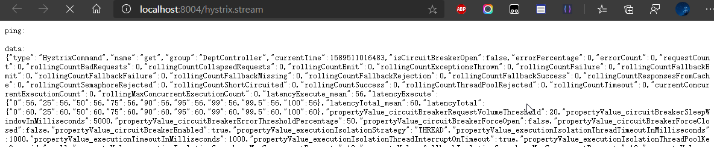

# SpringCloud学习笔记_V1

## 一、工程环境搭建

spring cloud版本：Dalston.SR1

spring boot版本：1.5.19.RELEASE

> ​	约定 > 配置 > 编码

### 1、构建父工程 spring-cloud-study-sgg-v1

#### 1、新建 Maven 工程 spring-cloud-study-sgg-v1

`pom.xml` 文件，其中 packaging 必须是 pom

```xml-dtd
<?xml version="1.0" encoding="UTF-8"?>
<project xmlns="http://maven.apache.org/POM/4.0.0"
         xmlns:xsi="http://www.w3.org/2001/XMLSchema-instance"
         xsi:schemaLocation="http://maven.apache.org/POM/4.0.0 http://maven.apache.org/xsd/maven-4.0.0.xsd">
    <modelVersion>4.0.0</modelVersion>

    <groupId>com.lcp.springcloud</groupId>
    <artifactId>spring-cloud-study-sgg-v1</artifactId>
    <version>1.0-SNAPSHOT</version>
    <packaging>pom</packaging>

    <properties>
        <project.build.sourceEncoding>UTF-8</project.build.sourceEncoding>
        <maven.compiler.source>1.8</maven.compiler.source>
        <maven.compiler.target>1.8</maven.compiler.target>
        <junit.version>4.12</junit.version>
        <log4j.version>1.2.17</log4j.version>
        <lombok.version>1.16.18</lombok.version>
    </properties>

    <dependencyManagement>
        <dependencies>
            <dependency>
                <groupId>org.springframework.cloud</groupId>
                <artifactId>spring-cloud-dependencies</artifactId>
                <version>Dalston.SR1</version>
                <type>pom</type>
                <scope>import</scope>
            </dependency>
            <dependency>
                <groupId>org.springframework.boot</groupId>
                <artifactId>spring-boot-dependencies</artifactId>
                <version>1.5.9.RELEASE</version>
                <type>pom</type>
                <scope>import</scope>
            </dependency>
            <dependency>
                <groupId>mysql</groupId>
                <artifactId>mysql-connector-java</artifactId>
                <version>8.0.19</version>
            </dependency>
            <dependency>
                <groupId>com.alibaba</groupId>
                <artifactId>druid</artifactId>
                <version>1.0.31</version>
            </dependency>
            <dependency>
                <groupId>org.mybatis.spring.boot</groupId>
                <artifactId>mybatis-spring-boot-starter</artifactId>
                <version>1.3.0</version>
            </dependency>
            <dependency>
                <groupId>ch.qos.logback</groupId>
                <artifactId>logback-core</artifactId>
                <version>1.2.3</version>
            </dependency>
            <dependency>
                <groupId>junit</groupId>
                <artifactId>junit</artifactId>
                <version>${junit.version}</version>
                <scope>test</scope>
            </dependency>
            <dependency>
                <groupId>log4j</groupId>
                <artifactId>log4j</artifactId>
                <version>${log4j.version}</version>
            </dependency>
        </dependencies>
    </dependencyManagement>

</project>
```

### 2、构建公共子模块 spring-cloud-api

#### 1、新建 Maven 工程 spring-cloud-api

`pom.xml` 文件

```xml-dtd
<?xml version="1.0" encoding="UTF-8"?>
<project xmlns="http://maven.apache.org/POM/4.0.0"
         xmlns:xsi="http://www.w3.org/2001/XMLSchema-instance"
         xsi:schemaLocation="http://maven.apache.org/POM/4.0.0 http://maven.apache.org/xsd/maven-4.0.0.xsd">
    <!-- 子类里面显示声明才能有明确的继承表现，无意外就是父类的默认版本否则自己定义 -->
    <parent>
        <artifactId>spring-cloud-study-sgg-v1</artifactId>
        <groupId>com.lcp.springcloud</groupId>
        <version>1.0-SNAPSHOT</version>
    </parent>
    <modelVersion>4.0.0</modelVersion>

    <!-- 当前Module我自己叫什么名字 -->
    <artifactId>spring-cloud-api</artifactId>

    <!-- 当前Module需要用到的jar包，按自己需求添加，如果父类已经包含了，可以不用写版本号 -->
    <dependencies>
        <dependency>
            <groupId>org.projectlombok</groupId>
            <artifactId>lombok</artifactId>
        </dependency>
    </dependencies>

</project>
```

#### 2、新建部门 Entity 并配合 Lombok 使用

```java
package com.lcp.springcloud.entities;

import lombok.AllArgsConstructor;
import lombok.Data;
import lombok.NoArgsConstructor;
import lombok.experimental.Accessors;
import java.io.Serializable;

@AllArgsConstructor
@NoArgsConstructor
@Data
@Accessors(chain = true)
public class Dept implements Serializable { // 必须序列化
    /**
     * 主键
     */
    private Long deptno;

    /**
     * 部门名称
     */
    private String dname;

    /**
     * 来自哪个数据库，因为微服务架构可以一个服务对应一个数据库，同一个信息被存储到不同数据库
     */
    private String db_source;

    public Dept(String dname) {
        super();
        this.dname = dname;
    }
}
```

#### 3、mvn clean，mvn install 

上述操作后给其它模块引用，达到通用的目的，其它模块需要用到部门实体的话，不用每一个工程都定义一份，直接引用本模块即可。

### 3、构建部门微服务提供者模块 spring-cloud-provider-dept-8001

#### 1、新建 Maven 工程 spring-cloud-provider-dept-8001

`pom.xml` 文件

```xml-dtd
<?xml version="1.0" encoding="UTF-8"?>
<project xmlns="http://maven.apache.org/POM/4.0.0"
         xmlns:xsi="http://www.w3.org/2001/XMLSchema-instance"
         xsi:schemaLocation="http://maven.apache.org/POM/4.0.0 http://maven.apache.org/xsd/maven-4.0.0.xsd">
    <parent>
        <artifactId>spring-cloud-study-sgg-v1</artifactId>
        <groupId>com.lcp.springcloud</groupId>
        <version>1.0-SNAPSHOT</version>
    </parent>
    <modelVersion>4.0.0</modelVersion>

    <artifactId>spring-cloud-provider-dept-8001</artifactId>

    <dependencies>
        <!-- 引入自己定义的 api 通用包，可以使用 Dept 部门 Entity -->
        <dependency>
            <groupId>com.lcp.springcloud</groupId>
            <artifactId>spring-cloud-api</artifactId>
            <version>${project.version}</version>
        </dependency>
        <dependency>
            <groupId>junit</groupId>
            <artifactId>junit</artifactId>
        </dependency>
        <dependency>
            <groupId>mysql</groupId>
            <artifactId>mysql-connector-java</artifactId>
        </dependency>
        <dependency>
            <groupId>com.alibaba</groupId>
            <artifactId>druid</artifactId>
        </dependency>
        <dependency>
            <groupId>ch.qos.logback</groupId>
            <artifactId>logback-core</artifactId>
        </dependency>
        <dependency>
            <groupId>org.mybatis.spring.boot</groupId>
            <artifactId>mybatis-spring-boot-starter</artifactId>
        </dependency>
        <dependency>
            <groupId>org.springframework.boot</groupId>
            <artifactId>spring-boot-starter-jetty</artifactId>
        </dependency>
        <dependency>
            <groupId>org.springframework.boot</groupId>
            <artifactId>spring-boot-starter-web</artifactId>
        </dependency>
        <dependency>
            <groupId>org.springframework.boot</groupId>
            <artifactId>spring-boot-starter-test</artifactId>
        </dependency>
        <!-- 修改后立即生效，热部署 -->
        <dependency>
            <groupId>org.springframework</groupId>
            <artifactId>springloaded</artifactId>
        </dependency>
        <dependency>
            <groupId>org.springframework.boot</groupId>
            <artifactId>spring-boot-devtools</artifactId>
        </dependency>
    </dependencies>
    
</project>
```

#### 2、application.yaml

```yaml
server:
  port: 8001

mybatis:
  config-location: classpath:mybatis/mybatis.cfg.xml        # mybatis配置文件所在路径
  type-aliases-package: com.lcp.springcloud.entities    # 所有Entity别名类所在包
  mapper-locations:
    - classpath:mybatis/mapper/**/*.xml                       # mapper映射文件

spring:
  application:
    # 应用名称
    name: spring-cloud-provider-dept
  datasource:
    type: com.alibaba.druid.pool.DruidDataSource            # 当前数据源操作类型
    driver-class-name: com.mysql.cj.jdbc.Driver              # mysql驱动包
    url: jdbc:mysql://localhost:3306/cloudDB01              # 数据库名称
    username: root
    password: 123456
    dbcp2:
      min-idle: 5                                           # 数据库连接池的最小维持连接数
      initial-size: 5                                       # 初始化连接数
      max-total: 5                                          # 最大连接数
      max-wait-millis: 200                                  # 等待连接获取的最大超时时间
```

#### 3、mybstis.cfg.xml

模块 `src/main/resources/mybatis` 目录下新建 `` 

```xml
<?xml version="1.0" encoding="UTF-8" ?>
<!DOCTYPE configuration
        PUBLIC "-//mybatis.org//DTD Config 3.0//EN"
        "http://mybatis.org/dtd/mybatis-3-config.dtd">

<configuration>

    <settings>
        <setting name="cacheEnabled" value="true"/><!-- 二级缓存开启 -->
    </settings>

    <typeAliases>
        <!--默认名称：指定包下 JavaBean 的非限定类名-->
        <package name ="com.lcp.springcloud" />
    </typeAliases>

</configuration>
```

#### 4、运行创建部门数据库脚本

```sql
DROP DATABASE IF EXISTS cloudDB01;
CREATE DATABASE cloudDB01 CHARACTER SET UTF8;
USE cloudDB01;
CREATE TABLE dept
(
  deptno BIGINT NOT NULL PRIMARY KEY AUTO_INCREMENT,
  dname VARCHAR(60),
  db_source   VARCHAR(60)
);
 
INSERT INTO dept(dname,db_source) VALUES('开发部',DATABASE());
INSERT INTO dept(dname,db_source) VALUES('人事部',DATABASE());
INSERT INTO dept(dname,db_source) VALUES('财务部',DATABASE());
INSERT INTO dept(dname,db_source) VALUES('市场部',DATABASE());
INSERT INTO dept(dname,db_source) VALUES('运维部',DATABASE());

SELECT * FROM dept;
```

#### 5、DeptDao 部门接口

```java
package com.lcp.springcloud.dao;

import com.lcp.springcloud.entities.Dept;
import org.apache.ibatis.annotations.Mapper;
import java.util.List;

@Mapper
public interface DeptDao {
    public boolean addDept(Dept dept);

    public Dept findById(Long id);

    public List<Dept> findAll();
}
```

#### 6、DeptMapper.xml

模块 `src/main/resources/mybatis/mapper` 目录下新建 `DeptMapper.xml` 

```xml
<?xml version="1.0" encoding="UTF-8" ?>
<!DOCTYPE mapper PUBLIC "-//mybatis.org//DTD Mapper 3.0//EN"
        "http://mybatis.org/dtd/mybatis-3-mapper.dtd">

<mapper namespace="com.lcp.springcloud.dao.DeptDao">

    <select id="findById" resultType="Dept" parameterType="Long">
   select deptno,dname,db_source from dept where deptno=#{deptno};
  </select>
    <select id="findAll" resultType="Dept">
   select deptno,dname,db_source from dept;
  </select>
    <insert id="addDept" parameterType="Dept">
   INSERT INTO dept(dname,db_source) VALUES(#{dname},DATABASE());
  </insert>

</mapper>
```

#### 7、DeptService 部门服务接口

```java
package com.lcp.springcloud.service;

import com.lcp.springcloud.entities.Dept;
import java.util.List;

public interface DeptService {
    public boolean add(Dept dept);

    public Dept get(Long id);

    public List<Dept> list();
}
```

#### 8、DeptServiceImpl 部门服务接口实现类

```java
package com.lcp.springcloud.service.impl;

import com.lcp.springcloud.dao.DeptDao;
import com.lcp.springcloud.entities.Dept;
import com.lcp.springcloud.service.DeptService;
import javax.annotation.Resource;
import java.util.List;

@Service
public class DeptServiceImpl implements DeptService {
    @Resource
    private DeptDao dao;

    @Override
    public boolean add(Dept dept) {
        return dao.addDept(dept);
    }

    @Override
    public Dept get(Long id) {
        return dao.findById(id);
    }

    @Override
    public List<Dept> list() {
        return dao.findAll();
    }
}
```

#### 9、DeptController 部门微服务提供者 REST

```java
package com.lcp.springcloud.controller;

import com.lcp.springcloud.entities.Dept;
import com.lcp.springcloud.service.DeptService;
import org.springframework.web.bind.annotation.*;
import javax.annotation.Resource;
import java.util.List;

@RestController
public class DeptController {
    @Resource
    private DeptService service;

    @RequestMapping(value="/dept/add",method= RequestMethod.POST)
    public boolean add(@RequestBody Dept dept) {
        return service.add(dept);
    }

    @RequestMapping(value="/dept/get/{id}",method=RequestMethod.GET)
    public Dept get(@PathVariable("id") Long id) {
        return service.get(id);
    }

    @RequestMapping(value="/dept/list",method=RequestMethod.GET)
    public List<Dept> list() {
        return service.list();
    }
}
```

#### 10、DeptProvider8001 启动类

```java
package com.lcp.springcloud;

import org.springframework.boot.SpringApplication;
import org.springframework.boot.autoconfigure.SpringBootApplication;

@SpringBootApplication
public class DeptProvider8001 {
    public static void main(String[] args) {
        SpringApplication.run(DeptProvider8001.class, args);
    }
}
```

#### 11、测试

启动该服务，在 Postman 使用以下地址进行测试

1. http://localhost:8001/dept/get/2

   ```json
   {
       "deptno": 2,
       "dname": "人事部",
       "db_source": "cloudDB01"
   }
   ```

2. http://localhost:8001/dept/list

   ```json
   [{"deptno":1,"dname":"开发部","db_source":"cloudDB01"},
    {"deptno":2,"dname":"人事部","db_source":"cloudDB01"},
    {"deptno":3,"dname":"财务部","db_source":"cloudDB01"},
    {"deptno":4,"dname":"市场部","db_source":"cloudDB01"},
    {"deptno":5,"dname":"运维部","db_source":"cloudDB01"}]
   ```

   > IDEA自带工具也可以进行测试：Tools -> Http Client -> Test RESTful Web Service
   >
   > 编写测试文件 `rest-api.http`
   >
   > ```http
   > GET http://localhost:8001/dept/list
   > Accept: application/json
   > 
   > ###
   > GET http://localhost:8001/dept/get/2
   > Accept: application/json
   > 
   > ###
   > ```

### 4、构建部门微服务消费者模块 spring-cloud-consumer-dept-80

#### 1、新建 Maven 工程 spring-cloud-consumer-dept-80

`pom.xml`

```xml
<?xml version="1.0" encoding="UTF-8"?>
<project xmlns="http://maven.apache.org/POM/4.0.0"
         xmlns:xsi="http://www.w3.org/2001/XMLSchema-instance"
         xsi:schemaLocation="http://maven.apache.org/POM/4.0.0 http://maven.apache.org/xsd/maven-4.0.0.xsd">
    <parent>
        <artifactId>spring-cloud-study-sgg-v1</artifactId>
        <groupId>com.lcp.springcloud</groupId>
        <version>1.0-SNAPSHOT</version>
    </parent>
    <modelVersion>4.0.0</modelVersion>

    <artifactId>spring-cloud-consumer-dept-80</artifactId>

    <dependencies>
        <!-- 自己定义的api -->
        <dependency>
            <groupId>com.lcp.springcloud</groupId>
            <artifactId>spring-cloud-api</artifactId>
            <version>1.0-SNAPSHOT</version>
        </dependency>
        <dependency>
            <groupId>org.springframework.boot</groupId>
            <artifactId>spring-boot-starter-web</artifactId>
        </dependency>
        <!-- 修改后立即生效，热部署 -->
        <dependency>
            <groupId>org.springframework</groupId>
            <artifactId>springloaded</artifactId>
        </dependency>
        <dependency>
            <groupId>org.springframework.boot</groupId>
            <artifactId>spring-boot-devtools</artifactId>
        </dependency>
    </dependencies>

</project>
```

#### 2、application.yaml

```yaml
server:
  port: 80
```

#### 3、ConfigBean

在 `com.lcp.springcloud.cfgbeans` 包下，类似于 spring 里面的 applicationContext.xml 编写的注入 Bean

```java
package com.lcp.springcloud.cfgbeans;

import org.springframework.context.annotation.Configuration;
import org.springframework.web.client.RestTemplate;

@Configuration
public class ConfigBean {
    
    @Bean
    public RestTemplate getRestTemplate() {
        return new RestTemplate();
    }
}
```

#### RestTemplate

RestTemplate提供了多种便捷访问远程Http服务的方法， 是一种简单便捷的访问restful服务模板类，是Spring提供的用于访问Rest服务的客户端模板工具集。

官网地址

https://docs.spring.io/spring-framework/docs/4.3.7.RELEASE/javadoc-api/org/springframework/web/client/RestTemplate.html

使用

使用 RestTemplate 访问 restful 接口非常的简单粗暴无脑，有三个主要参数

1. `url`：REST请求地址
2. `requestMap`：请求参数
3. `ResponseBean.class`：HTTP响应转换被转换成的对象类型

#### 4、DeptControllerConsumer

```java
package com.lcp.springcloud.controller;

import com.lcp.springcloud.entities.Dept;
import org.springframework.web.bind.annotation.*;
import org.springframework.web.client.RestTemplate;

import javax.annotation.Resource;
import java.util.List;

@RestController
@RequestMapping("/consumer/dept")
public class DeptControllerConsumer {
    private static final String REST_URL_PREFIX = "http://localhost:8001";

    @Resource
    private RestTemplate restTemplate;

    @PostMapping("/add")
    public boolean add(@RequestBody Dept dept) {
        return restTemplate.postForObject(REST_URL_PREFIX + "/dept/add", dept, Boolean.class);
    }

    @GetMapping(value = "/get/{id}")
    public Dept get(@PathVariable("id") Long id) {
        return restTemplate.getForObject(REST_URL_PREFIX + "/dept/get/" + id, Dept.class);
    }

    @SuppressWarnings("unchecked")
    @RequestMapping(value = "/list", method = RequestMethod.GET)
    public List<Dept> list() {
        return restTemplate.getForObject(REST_URL_PREFIX + "/dept/list", List.class);
    }
}
```

> @SuppressWarnings 注解告诉编译器忽略指定的警告，不用在编译完成后出现警告信息。
>
> https://www.cnblogs.com/liaojie970/p/9009199.html

#### 5、DeptConsumerApp80 启动类

```java
package com.lcp.springcloud;

import org.springframework.boot.SpringApplication;
import org.springframework.boot.autoconfigure.SpringBootApplication;

@SpringBootApplication
public class DeptConsumerApp80 {
    public static void main(String[] args) {
        SpringApplication.run(DeptConsumerApp80.class, args);
    }
}
```

#### 6、测试

启动服务进行测试，上一个服务也要启动

1. 访问：http://localhost/consumer/dept/get/2

   结果 一.1.11

2. 访问：http://localhost/consumer/dept/list

   结果同 一.1.11

3. 访问：http://localhost/consumer/dept/add

   ```
   true
   ```

IDEA rest-api.http

```http
GET http://localhost/consumer/dept/list
Accept: application/json

###
GET http://localhost/consumer/dept/get/2
Accept: application/json

###
POST http://localhost/consumer/dept/add
Content-Type: application/json

{
    "dname": "Test3",
    "db_source": "cloudDB01"
}
```

## 二、Eureka 服务注册与发现

### 1、是什么

读音：[eureka](https://fanyi.baidu.com/#en/zh/eureka)  美 [juˈriːkə] 

Eureka是Netflix的一个子模块，也是核心模块之一。Eureka是一个基于REST的服务，用于定位服务，以实现云端中间层服务发现和故障转移。服务注册与发现对于微服务架构来说是非常重要的，有了服务发现与注册，只需要使用服务的标识符，就可以访问到服务，而不需要修改服务调用的配置文件了。功能类似于dubbo的注册中心，比如Zookeeper。

Netflix 在设计 Eureka 是遵守 AP 原则

[CAP原则]([https://baike.baidu.com/item/CAP%E5%8E%9F%E5%88%99/5712863?fr=aladdin](https://baike.baidu.com/item/CAP原则/5712863?fr=aladdin)) 又称 CAP 定理，指的是在一个分布式系统中， Consistency（一致性）、 Availability（可用性）、Partition tolerance（分区容错性），三者不可得兼。

### 2、原理

#### 1、Eureka 基本架构

Spring Cloud 封装了 Netflix 公司开发的 Eureka 模块来实现服务注册和发现（请对比 Zookeeper）。

Eureka 采用了 C-S 的设计架构。Eureka Server 作为服务注册功能的服务器，它是服务注册中心。

而系统中的其他微服务，使用 Eureka 的客户端连接到 Eureka Server 并维持心跳连接。这样系统的维护人员就可以通过 Eureka Server 来监控系统中各个微服务是否正常运行。SpringCloud 的一些其他模块（比如 Zuul）就可以通过 Eureka Server 来发现系统中的其他微服务，并执行相关的逻辑。（请注意和 Dubbo 的架构对比）


Eureka 包含两个组件：`Eureka Server` 和 `Eureka Client`
Eureka Server 提供服务注册服务，各个节点启动后，会在EurekaServer中进行注册，这样EurekaServer中的服务注册表中将会存储所有可用服务节点的信息，服务节点的信息可以在界面中直观的看到

EurekaClient 是一个 Java 客户端，用于简化 Eureka Server 的交互，客户端同时也具备一个内置的、使用轮询(round-robin) 负载算法的负载均衡器。在应用启动后，将会向 Eureka Server 发送心跳（默认周期为30秒）。如果Eureka Server 在多个心跳周期内没有接收到某个节点的心跳，Eureka Server 将会从服务注册表中把这个服务节点移除（默认90秒）。

#### 2、三大角色

1. Eureka Server ：提供服务注册与发现
2. Service Provider ：服务提供方，将自身服务注册到 Eureka Server，从而使服务消费方能够找到
3. Service Consumer ：服务消费方，从 Eureka Server 获取注册服务列表，从而能够消费服务

#### 3、Eureka 自我保护机制

现象


什么是自我保护模式？

默认情况下，如果 Eureka Server 在一定时间内没有接收到某个微服务实例的心跳，Eureka Server 将会注销该实例（默认90秒）。但是当网络分区故障发生时，微服务与 Eureka Server 之间无法正常通信，以上行为可能变得非常危险了——因为微服务本身其实是健康的，此时本不应该注销这个微服务。Eureka 通过“自我保护模式”来解决这个问题——当 Eureka Server 节点在短时间内丢失过多客户端时（可能发生了网络分区故障），那么这个节点就会进入自我保护模式。一旦进入该模式，Eureka Server 就会保护服务注册表中的信息，不再删除服务注册表中的数据（也就是不会注销任何微服务）。当网络故障恢复后，该 Eureka Server节点会自动退出自我保护模式。

在自我保护模式中，Eureka Server 会保护服务注册表中的信息，不再注销任何服务实例。当它收到的心跳数重新恢复到阈值以上时，该 Eureka Server 节点就会自动退出自我保护模式。它的设计哲学就是宁可保留错误的服务注册信息，也不盲目注销任何可能健康的服务实例。一句话讲解：好死不如赖活着

综上，自我保护模式是一种应对网络异常的安全保护措施。它的架构哲学是宁可同时保留所有微服务（健康的微服务和不健康的微服务都会保留），也不盲目注销任何健康的微服务。使用自我保护模式，可以让 Eureka 集群更加的健壮、稳定。

在Spring Cloud中，可以使用 `eureka.server.enable-self-preservation = false` 禁用自我保护模式。

总结：某时刻一个微服务不可用了 eureka 不会立即清理，依旧会对该微服务的信息进行保存。

### 3、构建

#### 1、构建服务注册中心模块 spring-cloud-eureka-7001

##### 1、新建 Maven 工程 spring-cloud-eureka-7001

`pom.xml`

```xml-dtd
<?xml version="1.0" encoding="UTF-8"?>
<project xmlns="http://maven.apache.org/POM/4.0.0"
         xmlns:xsi="http://www.w3.org/2001/XMLSchema-instance"
         xsi:schemaLocation="http://maven.apache.org/POM/4.0.0 http://maven.apache.org/xsd/maven-4.0.0.xsd">
    <parent>
        <artifactId>spring-cloud-study-sgg-v1</artifactId>
        <groupId>com.lcp.springcloud</groupId>
        <version>1.0-SNAPSHOT</version>
    </parent>
    <modelVersion>4.0.0</modelVersion>

    <artifactId>spring-cloud-eureka-7001</artifactId>

    <dependencies>
        <!--eureka-server服务端 -->
        <dependency>
            <groupId>org.springframework.cloud</groupId>
            <artifactId>spring-cloud-starter-eureka-server</artifactId>
        </dependency>
        <!-- 修改后立即生效，热部署 -->
        <dependency>
            <groupId>org.springframework</groupId>
            <artifactId>springloaded</artifactId>
        </dependency>
        <dependency>
            <groupId>org.springframework.boot</groupId>
            <artifactId>spring-boot-devtools</artifactId>
        </dependency>
    </dependencies>

</project>
```

##### 2、application.yaml

```yaml
server:
  port: 7001

eureka:
  instance:
    # eureka服务端的实例名称
    hostname: localhost
  client:
    # false表示不向注册中心注册自己。
    register-with-eureka: false
    # false表示自己端就是注册中心，我的职责就是维护服务实例，并不需要去检索服务。
    fetch-registry: false
    service-url:
      # 设置与Eureka Server交互的地址查询服务和注册服务都需要依赖这个地址。
      defaultZone: http://${eureka.instance.hostname}:${server.port}/eureka/
```

##### 3、EurekaServerApp7001 主启动类

```java
package com.lcp.springcloud;

import org.springframework.boot.SpringApplication;
import org.springframework.boot.autoconfigure.SpringBootApplication;

/**
 * EurekaServer服务器端启动类,接受其它微服务注册进来
 */
@SpringBootApplication
@EnableEurekaServer
public class EurekaServerApp7001 {
    public static void main(String[] args) {
        SpringApplication.run(EurekaServerApp7001.class, args);
    }
}
```

##### 4、测试

访问地址：http://localhost:7001，结果如下


#### 2、spring-cloud-provider-dept-8001 服务注册（register）

修改 spring-cloud-provider-dept-8001 ，将其注册到 Eureka Server

##### 1、修改 pom.xml

增加以下内容

```xml
<!-- 添加依赖，将微服务provider侧注册进eureka -->
<dependency>
    <groupId>org.springframework.cloud</groupId>
    <artifactId>spring-cloud-starter-eureka</artifactId>
</dependency>
<dependency>
    <groupId>org.springframework.cloud</groupId>
    <artifactId>spring-cloud-starter-config</artifactId>
</dependency>
```

##### 2、修改 application.yaml

增加以下内容

```yaml
eureka:
  # 客户端注册进eureka服务列表内
  client: 
    service-url: 
      defaultZone: http://localhost:7001/eureka
```

##### 3、修改 DeptProviderApp8001

在启动类上添加 `@EnableEurekaClient` 表示这是一个 Eureka 客户端，服务启动后会自动注册到 Eureka Server

```java
package com.lcp.springcloud;

import org.springframework.boot.SpringApplication;
import org.springframework.boot.autoconfigure.SpringBootApplication;
import org.springframework.cloud.netflix.eureka.EnableEurekaClient;

/**
 * {@code @EnableEurekaClient} 表示这是一个 Eureka 客户端，服务启动后会自动注册到 Eureka Server
 */
@SpringBootApplication
@EnableEurekaClient
public class DeptProviderApp8001 {
    public static void main(String[] args) {
        SpringApplication.run(DeptProviderApp8001.class, args);
    }
}
```

##### 4、测试

先启动 Eureka Server，再启动本模块，浏览器访问：http://localhost:7001，结果如下


PS：Application 对应 application.yaml 中的 spring.application.name

#### 3、Actuator 与注册微服务信息完善

Eureka Server 的页面目前存在的问题


1. Status 中含有主机名称
2. 超链接中没有 IP
3. 单击超链接跳转到对应微服务的 info 页面时为 404 ErrorPage

##### 1、主机名称:服务名称修改

修改 application.yaml

```yaml
eureka:
  # 客户端注册进eureka服务列表内
  client:
    service-url:
      defaultZone: http://localhost:7001/eureka
  instance:
    # 自定义服务名称信息
    instance-id: provider-dept-8001
```

修改后


##### 2、访问信息有IP提示

修改 application.yaml

```yaml
eureka:
  # 客户端注册进eureka服务列表内
  client:
    service-url:
      defaultZone: http://localhost:7001/eureka
  instance:
    # 自定义服务名称信息
    instance-id: provider-dept-8001
    # 访问路径可以显示IP地址
    prefer-ip-address: true
```

修改后


##### 3、微服务 info 内容详细信息

修改  spring-cloud-provider-dept-8001 的 pom.xml 添加以下依赖

```xml
 <dependency>
    <groupId>org.springframework.boot</groupId>
    <artifactId>spring-boot-starter-actuator</artifactId>
</dependency>
```

修改父工程的 pom.xml 添加 build 信息

```xml
<build>
        <finalName>spring-cloud-study-sgg-v1</finalName>
        <resources>
            <resource>
                <directory>src/main/resources</directory>
                <filtering>true</filtering>
            </resource>
        </resources>
        <plugins>
            <plugin>
                <groupId>org.apache.maven.plugins</groupId>
                <artifactId>maven-resources-plugin</artifactId>
                <configuration>
                    <delimiters>
                        <!-- 注意是 delimiter 不是 delimit -->
                        <delimiter>$</delimiter>
                    </delimiters>
                </configuration>
            </plugin>
        </plugins>
    </build>
```

> 需要注意的是 delimiter 不要写成 delimit，不然下面的 $project.version$ 会取不到值

修改  spring-cloud-provider-dept-8001 的 application.yaml 添加以下内容

```yaml
info:
  app.name: spring-cloud-study-sgg-v1
  company.name: www.lichangping.top
  build.artifactId: $project.artifactId$
  build.version: $project.version$
```

#### 4、spring-cloud-provider-dept-8001 服务发现（discovery）

对于注册进 eureka 中的服务，可以通用过服务发现来获取该服务的信息

下面对 spring-cloud-provider-dept-8001 进行修改

##### 1、修改 DeptController 

增加以下内容

```java
@RestController
@RequestMapping("/dept")
public class DeptController {
    // import org.springframework.cloud.client.discovery.DiscoveryClient;
	@Resource
    private DiscoveryClient discoveryClient;
    
    @GetMapping(value = "/discovery")
    public Object discovery(){
        List<String> services = discoveryClient.getServices();
        System.out.println("*********" + services);

        List<ServiceInstance> srvList = discoveryClient.getInstances("PROVIDER-DEPT-8001");
        for (ServiceInstance element : srvList) {
            System.out.println(element.getServiceId() + "\t" + element.getHost() + "\t" + element.getPort() + "\t"
                    + element.getUri());
        }
        return this.discoveryClient;
    }
}
```

##### 2、修改 DeptProviderApp8001

增加注解 `@EnableDiscoveryClient`

```java
/**
 * {@code @EnableDiscoveryClient} 开启服务发现
 */
@SpringBootApplication
@EnableEurekaClient
@EnableDiscoveryClient
public class DeptProviderApp8001 {
    public static void main(String[] args) {
        SpringApplication.run(DeptProviderApp8001.class, args);
    }
}
```

##### 3、测试

先启动 EurekaServerApp7001，再启动 DeptProviderApp8001，访问：http://localhost:8001/dept/discovery，结果如下

```json
{
  "services": [
    "spring-cloud-provider-dept"
  ],
  "localServiceInstance": {
    "host": "192.168.70.1",
    "port": 8001,
    "uri": "http://192.168.70.1:8001",
    "serviceId": "spring-cloud-provider-dept",
    "metadata": {},
    "secure": false
  }
}
```

##### 4、测试消费端调用服务发现

修改 spring-cloud-consumer-dept-80 的 DeptControllerConsumer

在类中增加下面这个方法

```java
@RequestMapping(value = "/dept/discovery")
public Object discovery() {
    return restTemplate.getForObject(REST_URL_PREFIX + "/dept/discovery", Object.class);
}
```

访问：http://localhost/consumer/dept/dept/discovery，结果如下

```json
{
  "services": [
    "spring-cloud-provider-dept"
  ],
  "localServiceInstance": {
    "host": "192.168.70.1",
    "port": 8001,
    "uri": "http://192.168.70.1:8001",
    "serviceId": "spring-cloud-provider-dept",
    "metadata": {},
    "secure": false
  }
}
```

### 4、Eureka 集群配置

#### 1、原理


基本原理

上图是来自 Eureka 的官方架构图，这是基于集群配置的 Eureka

- 处于不同节点的eureka通过Replicate进行数据同步 
- Application Service为服务提供者 
- Application Client为服务消费者 
- Make Remote Call完成一次服务调用

服务启动后向Eureka注册，Eureka Server会将注册信息向其他Eureka Server进行同步，当服务消费者要调用服务提供者，则向服务注册中心获取服务提供者地址，然后会将服务提供者地址缓存在本地，下次再调用时，则直接从本地缓存中取，完成一次调用。

当服务注册中心Eureka Server检测到服务提供者因为宕机、网络原因不可用时，则在服务注册中心将服务置为DOWN状态，并把当前服务提供者状态向订阅者发布，订阅过的服务消费者更新本地缓存。

服务提供者在启动后，周期性（默认30秒）向Eureka Server发送心跳，以证明当前服务是可用状态。Eureka Server在一定的时间（默认90秒）未收到客户端的心跳，则认为服务宕机，注销该实例。

#### 2、构建集群

##### 1、新建两个 Eureka Server

以 spring-cloud-eureka-7001 为模板，新建 spring-cloud-eureka-7002 spring-cloud-eureka-7003

##### 2、修改映射配置

编辑 hosts 文件

```
127.0.0.1 eureka7001.com
127.0.0.1 eureka7002.com
127.0.0.1 eureka7003.com
```

##### 3、修改三个 Eureka 的 yaml配置

7001 application.yaml

```yaml
server:
  port: 7001

eureka:
  instance:
    # eureka服务端的实例名称
    hostname: eureka7001.com
  client:
    # false表示不向注册中心注册自己。
    register-with-eureka: false
    # false表示自己端就是注册中心，我的职责就是维护服务实例，并不需要去检索服务。
    fetch-registry: false
    service-url:
      # 设置与Eureka Server交互的地址查询服务和注册服务都需要依赖这个地址。
      defaultZone: http://eureka7002.com:7002/eureka/,http://eureka7003.com:7003/eureka/

spring:
  application:
    name: spring-cloud-eureka-7001
```

7002 application.yaml

```yaml
server:
  port: 7002

eureka:
  instance:
    # eureka服务端的实例名称
    hostname: eureka7002.com
  client:
    # false表示不向注册中心注册自己。
    register-with-eureka: false
    # false表示自己端就是注册中心，我的职责就是维护服务实例，并不需要去检索服务。
    fetch-registry: false
    service-url:
      # 设置与Eureka Server交互的地址查询服务和注册服务都需要依赖这个地址。
      # defaultZone: http://${eureka.instance.hostname}:${server.port}/eureka/
      defaultZone: http://eureka7001.com:7001/eureka/,http://eureka7003.com:7003/eureka/

spring:
  application:
    name: spring-cloud-eureka-7002
```

7003 application.yaml

```yaml
server:
  port: 7003

eureka:
  instance:
    # eureka服务端的实例名称
    hostname: eureka7003.com
  client:
    # false表示不向注册中心注册自己。
    register-with-eureka: false
    # false表示自己端就是注册中心，我的职责就是维护服务实例，并不需要去检索服务。
    fetch-registry: false
    service-url:
      # 设置与Eureka Server交互的地址查询服务和注册服务都需要依赖这个地址。
      # defaultZone: http://${eureka.instance.hostname}:${server.port}/eureka/
      defaultZone: http://eureka7001.com:7001/eureka/,http://eureka7002.com:7002/eureka/

spring:
  application:
    name: spring-cloud-eureka-7003
```

##### 4、将 spring-cloud-provider-dept-8001 发布到三台 Eureka Server 中

修改 spring-cloud-provider-dept-8001 的 yaml 配置

```yaml
eureka:
  # 客户端注册进eureka服务列表内
  client:
    service-url:
      # defaultZone: http://localhost:7001/eureka
      defaultZone: http://eureka7001.com:7001/eureka/,http://eureka7002.com:7002/eureka/,http://eureka7003.com:7003/eureka/
```

##### 5、测试

访问：http://eureka7003.com:7003/，http://eureka7002.com:7002/，http://eureka7002.com:7002/

如果集群配置成功，则应在每一个的页面中看到另外两个 Eureka Server，例如下图


##### 关于 `unavailable-replicas`【重要】\*\*\*\*\*\*

在上一步成功的前提下，观察 General Info 我们可以发现，另外的两个节点虽然注册成功了，但却都是 unavailable-replicas，available-replicas 为空，这说明集群虽然搭建成功，但并不是高可用。


参考：https://blog.csdn.net/liupeifeng3514/article/details/85273961

生产环境部署可参考：https://www.cnblogs.com/lonelyJay/tag/springcloud/

继续修改三个 Eurake 的 yaml，将单节点情况下的 `register-with-eureka` `fetch-registry` 由 false 改为 true

```yaml
eureka:
  instance:
    hostname: eureka7003.com
  client:
    register-with-eureka: true
    fetch-registry: true
```

>spring.application.name：这项要么不设，要么设成一样
>
>prefer-ip-address：要么不设，要么为 false

修改后的 application.yaml ，以 spring-cloud-eureka-7001 为例

```yaml
server:
  port: 7002

eureka:
  instance:
    # eureka服务端的实例名称
    hostname: eureka7002.com
    instance-id: eureka-7002
  #    prefer-ip-address: false
  client:
    # false表示不向注册中心注册自己，配置集群时需设为 true
    register-with-eureka: true
    # false表示自己端就是注册中心，我的职责就是维护服务实例，并不需要去检索服务。
    fetch-registry: false
    service-url:
      # 设置与Eureka Server交互的地址查询服务和注册服务都需要依赖这个地址。
      # defaultZone: http://${eureka.instance.hostname}:${server.port}/eureka/
      defaultZone: http://eureka7001.com:7001/eureka/,http://eureka7003.com:7003/eureka/

spring:
  application:
    name: spring-cloud-eureka
```

此时集群状态，以 spring-cloud-eureka-7001 为例


可以看到另外两个节点均在 `available-replicas` 中，高可用完成。

此时停掉 spring-cloud-eureka-7001，去 http://eureka7002.com:7002/ 查看，发现 spring-cloud-eureka-7001 出现在 unavailable-replicas 符合预期。

> 如果关闭后，spring-cloud-eureka-7001 仍然长时间位于 `available-replicas` 中，可以尝试添加以下配置，这些配置仅用于测试环境
>
> ```yaml
> eureka:
> 	server:
>   # 测试时关闭自我保护机制，保证不可用服务及时剔除
>   enable-self-preservation: false
>   # 缩短 eureka server 清理无效节点的时间间隔，默认60000毫秒，即60秒，现在调整为间隔2秒
>   eviction-interval-timer-in-ms: 5000
> # 要想见效再快一些，可以添加下面这些配置
> instance:
> 		lease-renewal-interval-in-seconds: 5
> 		lease-expiration-duration-in-seconds: 10
> ```
>
> 参考：spring cloud eureka 参数配置：https://www.jianshu.com/p/e2bebfb0d075
>
> 因此可以修改所有 client，加入以下配置，以便测试时更快看到变化
>
> ```yaml
> eureka:
>   instance:
>     # 心跳时间，即服务续约间隔时间（缺省为30s）
>     lease-renewal-interval-in-seconds: 5
>      # 发呆时间，即服务续约到期时间（缺省为90s）
>     lease-expiration-duration-in-seconds: 10
>   client:
>     # 开启健康检查（依赖spring-boot-starter-actuator）
>     healthcheck:
>       enabled: true
> ```


### 5、作为服务注册中心，Eureka 比 Zookeeper 好在哪里

著名的CAP理论指出，一个分布式系统不可能同时满足 C（一致性）、A（可用性）和 P（分区容错性）。由于分区容错性 P 在是分布式系统中必须要保证的，因此我们只能在 A 和 C 之间进行权衡，因此 `Zookeeper 保证的是 CP`，`Eureka 则是AP`。

Zookeeper 保证 CP

当向注册中心查询服务列表时，我们可以容忍注册中心返回的是几分钟以前的注册信息，但不能接受服务直接down 掉不可用。也就是说，服务注册功能对可用性的要求要高于一致性。但是 zk 会出现这样一种情况，当 master 节点因为网络故障与其他节点失去联系时，剩余节点会重新进行 leader 选举。问题在于，选举 leader 的时间太长，30 ~ 120s, 且选举期间整个 zk 集群都是不可用的，这就导致在选举期间注册服务瘫痪。在云部署的环境下，因网络问题使得 zk 集群失去 master 节点是较大概率会发生的事，虽然服务能够最终恢复，但是漫长的选举时间导致的注册长期不可用是不能容忍的。

Eureka 保证 AP

Eureka 看明白了这一点，因此在设计时就优先保证可用性。Eureka 各个节点都是平等的，几个节点挂掉不会影响正常节点的工作，剩余的节点依然可以提供注册和查询服务。而 Eureka 的客户端在向某个 Eureka 注册或时如果发现连接失败，则会自动切换至其它节点，只要有一台 Eureka 还在，就能保证注册服务可用(保证可用性)，只不过查到的信息可能不是最新的(不保证强一致性)。除此之外，Eureka 还有一种自我保护机制，如果在15分钟内超过85%的节点都没有正常的心跳，那么 Eureka 就认为客户端与注册中心出现了网络故障，此时会出现以下几种情况： 

1. Eureka 不再从注册列表中移除因为长时间没收到心跳而应该过期的服务 
2. Eureka 仍然能够接受新服务的注册和查询请求，但是不会被同步到其它节点上(即保证当前节点依然可用) 
3. 当网络稳定时，当前实例新的注册信息会被同步到其它节点中

**因此， Eureka 可以很好的应对因网络故障导致部分节点失去联系的情况，而不会像 zookeeper 那样使整个注册服务瘫痪。**

## 三、Ribbon 负载均衡

### 1、概述

#### 1、是什么

读音：[ribbon](https://fanyi.baidu.com/#en/zh/ribbon) 美 [ˈrɪbən] 

Spring Cloud Ribbon 是基于 Netflix Ribbon 实现的一套 **客户端负载均衡** 的工具。

简单的说，Ribbon 是 Netflix 发布的开源项目，主要功能是提供客户端的软件负载均衡算法，将 Netflix 的中间层服务连接在一起。Ribbon 客户端组件提供一系列完善的配置项如连接超时，重试等。简单的说，就是在配置文件中列出 Load Balancer（简称LB）后面所有的机器，Ribbon 会自动的帮助你基于某种规则（如简单轮询，随机连接等）去连接这些机器。我们也很容易使用 Ribbon 实现自定义的负载均衡算法。

#### 2、作用 LB（负载均衡）

LB，即负载均衡（Load Balance），在微服务或分布式集群中经常用的一种应用。

负载均衡简单的说就是将用户的请求平摊的分配到多个服务上，从而达到系统的 HA（High Available）。常见的负载均衡有软件Nginx，LVS，硬件 F5等。相应的在中间件，例如：dubbo 和 SpringCloud 中均给我们提供了负载均衡，SpringCloud 的负载均衡算法可以自定义。 

##### 集中式 LB

即在服务的消费方和提供方之间使用独立的 LB 设施（可以是硬件，如 F5, 也可以是软件，如 nginx）, 由该设施负责把访问请求通过某种策略转发至服务的提供方。

##### 进程内 LB

将 LB 逻辑集成到消费方，消费方从服务注册中心获知有哪些地址可用，然后自己再从这些地址中选择出一个合适的服务器。

Ribbon 就属于进程内 LB，它只是一个类库，集成于消费方进程，消费方通过它来获取到服务提供方的地址。

#### 3、官网

https://github.com/Netflix/ribbon/wiki/Getting-Started

### 2、Ribbon 初步配置 

修改 spring-cloud-consumer-dept-80

#### 1、修改 pom.xml

增加 Ribbon 相关依赖

```xml
<!-- Ribbon相关 -->
<dependency>
    <groupId>org.springframework.cloud</groupId>
    <artifactId>spring-cloud-starter-eureka</artifactId>
</dependency>
<dependency>
    <groupId>org.springframework.cloud</groupId>
    <artifactId>spring-cloud-starter-ribbon</artifactId>
</dependency>
<dependency>
    <groupId>org.springframework.cloud</groupId>
    <artifactId>spring-cloud-starter-config</artifactId>
</dependency>
```

#### 2、修改 application.yaml

追加 eureka 的服务注册地址

```yaml
eureka:
  client:
    register-with-eureka: false
    service-url: 
      defaultZone: http://eureka7001.com:7001/eureka/,http://eureka7002.com:7002/eureka/,http://eureka7003.com:7003/eureka/
```

#### 3、修改 ConfigBean

在 ConfigBean 上加上新注解 @LoadBalanced，使其获得 Rest 时加入 Ribbon 的配置

```java
@Configuration
public class ConfigBean {
    @Bean
    @LoadBalanced
    public RestTemplate getRestTemplate() {
        return new RestTemplate();
    }
}
```

#### 4、修改 DeptConsumerApp80

主启动类 DeptConsumerApp80 添加 @EnableEurekaClient

```java
@SpringBootApplication
@EnableEurekaClient
public class DeptConsumerApp80 {
    public static void main(String[] args) {
        SpringApplication.run(DeptConsumerApp80.class, args);
    }
}
```

#### 5、修改 DeptControllerConsumer

修改 REST_URL_PREFIX

```java
/**
 * private static final String REST_URL_PREFIX = "http://localhost:8001";
 *
 * SPRING-CLOUD-PROVIDER-DEPT 就是 spring.application.name 的大写，
 * 也就是 Eureka Server 浏览器面板中 Application 下对应的名字
 */
 private static final String REST_URL_PREFIX = "http://SPRING-CLOUD-PROVIDER-DEPT";
```

#### 6、测试

1. 访问：http://localhost/consumer/dept/list，结果如下

   ```json
   [{"deptno":1,"dname":"开发部","db_source":"cloudDB01"},
    ......
    {"deptno":10,"dname":"Test2","db_source":"cloudDB01"}]
   ```

2. 访问：http://localhost/consumer/dept/get/1，结果如下

   ```json
   {"deptno":1,"dname":"开发部","db_source":"cloudDB01"}
   ```

3. 访问：http://localhost/consumer/dept/add，rest-api.http 如下

   ```http
   POST http://localhost/consumer/dept/add
   Content-Type: application/json
   
   {
       "dname": "Test3",
       "db_source": "cloudDB01"
   }
   ```

   结果如下

   ```
   true
   ```

#### 7、小结

Ribbon 和 Eureka 整合后 Consumer 可以直接根据服务名调用服务，而不用关心具体的 IP 和端口号

### 3、Ribbon 负载均衡

#### 1、架构说明


Ribbon 在工作时分成两步

第一步先选择 Eureka Server，它优先选择在同一个区域内负载较少的 Server.

第二步再根据用户指定的策略，在从 Server 取到的服务注册列表中选择一个地址。

其中 Ribbon 提供了多种策略：比如轮询、随机和根据响应时间加权。

#### 2、新建 spring-cloud-provider-dept-8002/8003

参考 spring-cloud-provider-dept-8001，新建模块 spring-cloud-provider-dept-8002，spring-cloud-provider-dept-8003

#### 3、新建 cloudDB02，cloudDB03

新建 spring-cloud-provider-dept-8002/8003 各自的数据库 cloudDB02/cloudDB03，sql 脚本如下

cloudDB02.sql

```sql
DROP DATABASE IF EXISTS cloudDB02;
CREATE DATABASE cloudDB02 CHARACTER SET UTF8;
USE cloudDB02;
 
CREATE TABLE dept
(
  deptno BIGINT NOT NULL PRIMARY KEY AUTO_INCREMENT,
  dname VARCHAR(60),
  db_source   VARCHAR(60)
);
 
INSERT INTO dept(dname,db_source) VALUES('开发部',DATABASE());
INSERT INTO dept(dname,db_source) VALUES('人事部',DATABASE());
INSERT INTO dept(dname,db_source) VALUES('财务部',DATABASE());
INSERT INTO dept(dname,db_source) VALUES('市场部',DATABASE());
INSERT INTO dept(dname,db_source) VALUES('运维部',DATABASE());
 
SELECT * FROM dept;
```

cloudDB03.sql

```sql
DROP DATABASE IF EXISTS cloudDB03;
CREATE DATABASE cloudDB03 CHARACTER SET UTF8; 
USE cloudDB03;

CREATE TABLE dept
(
  deptno BIGINT NOT NULL PRIMARY KEY AUTO_INCREMENT,
  dname VARCHAR(60),
  db_source   VARCHAR(60)
);
 
INSERT INTO dept(dname,db_source) VALUES('开发部',DATABASE());
INSERT INTO dept(dname,db_source) VALUES('人事部',DATABASE());
INSERT INTO dept(dname,db_source) VALUES('财务部',DATABASE());
INSERT INTO dept(dname,db_source) VALUES('市场部',DATABASE());
INSERT INTO dept(dname,db_source) VALUES('运维部',DATABASE());
 
SELECT * FROM dept;
```

#### 4、修改 application.yaml

修改 spring-cloud-provider-dept-8002，spring-cloud-provider-dept-8002，spring-cloud-provider-dept-8003 的 yaml

保证下面一项是一致的

```yaml
spring:
  application:
    # 应用名称
    name: spring-cloud-provider-dept
```

spring-cloud-provider-dept-8002 端口 8002，数据库 cloudDB02。

spring-cloud-provider-dept-8003 端口 8003，数据库 cloudDB03。

#### 5、Dept 微服务集群自测

1. 访问：http://localhost:8001/dept/list，结果如下

   ```json
   [{"deptno":1,"dname":"开发部","db_source":"cloudDB03"},
    ......
    {"deptno":5,"dname":"运维部","db_source":"cloudDB03"}]
   ```

2. 访问：http://localhost:8002/dept/list，结果同上

3. 访问：http://localhost:8003/dept/list，结果同上

#### 6、测试客户端通过 Ribbon 负载均衡访问 Dept 集群

访问：http://localhost/consumer/dept/list，注意观察返回结果中数据库的名字，每次基本都不相同，说明负载均衡生效。

#### 7、总结

Ribbon 其实就是一个软负载均衡的客户端组件，他可以和其它所需清求的客户端结合使用，和 Eureka 结合只是具中的一个实例。

### 4、Ribbon 核心组件 IRule

IRule 根据特定算法从服务列表选取一个要访问的服务

#### 1、RoundRobinRule

轮询

#### 2、RandomRule

随机

#### 3、AvailabilityFilteringRule

先过滤掉由于多次访问故障而处于熔断器熔断状态的服务以及并发的连接数量超过阈值的服务，然后对剩余的服务列表按照轮询策略进行访问

#### 4、WeightedResponseTimeRule

根据平均响应时间计算所有服务的权重，响应时间越短的服务权重越大，被选中的概率越高。

刚启动时如果统计信息不足，则使用 RoundRobinRule 策略，等到统计信息足够，会切换到 WeightedResponseTimeRule。

#### 5、RetryRule

先按照 RoundRobinRule 的策略获取服务，如果获取服务失败则会在指定的时间内重试，以获取可用的服务。

#### 6、BestAvailabeRule

会先过滤掉由于多次访问故障而处于熔断器熔断状态的服务，然后选择一个并发量最小的服务

#### 7、ZoneAvoidanceRule

默认规则，复合判断 Server 所在区域的性能和 Server 的可用性来选择服务器。

#### 切换 Ribbon 内置的负载均衡算法

修改 spring-cloud-consumer-dept-80 的 `ConfigBean`

```java
@Configuration
public class ConfigBean {

    @Bean
    @LoadBalanced
    public RestTemplate getRestTemplate() {
        return new RestTemplate();
    }

    @Bean
    public IRule myRule() {
        // 用选择的随机选择算法替代默认算法
        return new RandomRule();
    }
}
```

### 5、Ribbon 自定义

修改 spring-cloud-consumer-dept-80

#### 1、主启动类添加 @RibbonClient


在启动该微服务的时候就能去加载我们的自定义Ribbon配置类，从而使配置生效，形如：

`@RibbonClient(name="MICROSERVICECLOUD-DEPT",configuration=MySelfRule.class)`

#### 2、注意配置细节 

官方文档明确给出了警告：

这个自定义配置类不能放在@ComponentScan所扫描的当前包下以及子包下，否则我们自定义的这个配置类就会被所有的 Ribbon 客户端所共享，也就是说我们达不到特殊化定制的目的了。


##### 新建 com.lcp.myrule.MySelfRule.java

```java
@Configuration
public class MySelfRule {
    @Bean
    public IRule myRule()
    {
        //Ribbon默认是轮询，这里自定义为随机
        return new RandomRule();
    }
}
```

##### 修改主启动类

```java
import com.lcp.myrule.MySelfRule;

@SpringBootApplication
@EnableEurekaClient
@RibbonClient(name = "SPRING-CLOUD-PROVIDER-DEPT",configuration = MySelfRule.class)
public class DeptConsumerApp80 {
    public static void main(String[] args) {
        SpringApplication.run(DeptConsumerApp80.class, args);
    }
}
```

##### 测试

访问：http://localhost/consumer/dept/list

### 3、深度自定义规则

问题：依旧轮询策略，但是加上新需求，每个服务要求被调用5次，也就是以前每个服务被调用1次，现在每个服务被调用5次。

#### 查看源码

https://github.com/Netflix/ribbon/blob/master/ribbon-loadbalancer/src/main/java/com/netflix/loadbalancer/RandomRule.java

#### 参考源码编写满足需求的 RoundRobinLcp.java

```java
package com.lcp.myrule;

import com.netflix.client.config.IClientConfig;
import com.netflix.loadbalancer.AbstractLoadBalancerRule;
import com.netflix.loadbalancer.ILoadBalancer;
import com.netflix.loadbalancer.Server;

import java.util.List;

/**
 * 需求：依旧是轮询策略，但是要求每个服务被调用五次，而不是原来的一次
 */
public class RoundRobinLcp extends AbstractLoadBalancerRule {
    // 总共被调用的次数，目前要求每台被调用5次    
    private int total = 0;

    // 当前提供服务的机器号
    private int currentIndex = 0;

    public Server choose(ILoadBalancer lb, Object key) {
        if (lb == null) {
            return null;
        }
        Server server = null;

        while (server == null) {
            if (Thread.interrupted()) {
                return null;
            }
            List<Server> upList = lb.getReachableServers();
            List<Server> allList = lb.getAllServers();

            int serverCount = allList.size();
            if (serverCount == 0) {
                return null;
            }

            // int index = chooseRandomInt(serverCount);
            // server = upList.get(index);

            if (total < 5) {
                server = upList.get(currentIndex);
                total++;
            } else {
                total = 0;
                currentIndex++;
                if (currentIndex >= upList.size()) {
                    currentIndex = 0;
                }
            }

            if (server == null) {
                Thread.yield();
                continue;
            }

            if (server.isAlive()) {
                return (server);
            }
            
            server = null;
            Thread.yield();
        }

        return server;
    }

    @Override
    public Server choose(Object key) {return choose(getLoadBalancer(), key);}

    @Override
    public void initWithNiwsConfig(IClientConfig iClientConfig) {}
}
```

#### 修改 MySelfRule

```java
@Configuration
public class MySelfRule {
    @Bean
    public IRule myRule()
    {
        //Ribbon默认是轮询，这里自定义为自定义轮询
        return new RoundRobinLcp();
    }
}
```

#### 启动并测试

访问：http://localhost/consumer/dept/list

## 四、Feign 负载均衡

### 1、概述

读音：[feign](https://fanyi.baidu.com/#en/zh/feign) 美 [feɪn]

官网：https://projects.spring.io/spring-cloud/spring-cloud.html#spring-cloud-feign

#### Feign 是什么

Feign 是一个声明式 Web Service 客户端。使用 Feign能让编写 Web Service 客户端更加简单, 它的使用方法是定义一个接口，然后在上面添加注解，同时也支持 JAX-RS 标准的注解。Feign 也支持可拔插式的编码器和解码器。Spring Cloud 对 Feign 进行了封装，使其支持了 Spring MVC 标准注解和 HttpMessageConverters。Feign 可以与 Eureka 和 Ribbon 组合使用以支持负载均衡。


Feign是一个声明式的 Web Service 客户端，使得编写Web服务客户端变得非常容易，只需要创建一个接口，然后在上面添加注解即可。参考官网：https://github.com/OpenFeign/feign 

#### Feign 能干什么

Feign 旨在使编写 Java Http 客户端变得更容易。
前面在使用Ribbon + RestTemplate 时，利用 RestTemplate 对 http 请求的封装处理，形成了一套模版化的调用方法。但是在实际开发中，由于对服务依赖的调用可能不止一处，往往一个接口会被多处调用，所以通常都会针对每个微服务自行封装一些客户端类来包装这些依赖服务的调用。所以，Feign 在此基础上做了进一步封装，由他来帮助我们定义和实现依赖服务接口的定义。在 Feign 的实现下，我们只需创建一个接口并使用注解的方式来配置它(以前是 Dao 接口上面标注 Mapper 注解,现在是一个微服务接口上面标注一个 Feign 注解即可)，即可完成对服务提供方的接口绑定，简化了使用 Spring cloud Ribbon 时，自动封装服务调用客户端的开发量。

Feign 集成了 Ribbon

利用 Ribbon 维护了 spring-cloud-provider-dept 的服务列表信息，并且通过轮询实现了客户端的负载均衡。而与 Ribbon 不同的是，通过 feign 只需要定义服务绑定接口且以声明式的方法，优雅而简单的实现了服务调用。

### 2、Feign 使用

#### 1、新建 Maven 工程 spring-cloud-consumer-dept-feign-81

参考 spring-cloud-consumer-dept-80 新建 spring-cloud-consumer-dept-feign-81

- 修改主启动类名字为 DeptConsumerFeignApp81

- 修改 application.yaml

  - instance-id: consumer-dept-feign-81
  - port: 81

- 修改 pom.xml，添加以下依赖

  ```xml
  <dependency>
      <groupId>org.springframework.cloud</groupId>
      <artifactId>spring-cloud-starter-feign</artifactId>
  </dependency>
  ```

#### 2、修改 spring-cloud-api

- 修改 pom.xml，添加 feign 依赖

  ```xml
  <dependency>
      <groupId>org.springframework.cloud</groupId>
      <artifactId>spring-cloud-starter-feign</artifactId>
  </dependency>
  ```

- 新建 DeptClientService 接口

  @FeignClient 注解用于指定从哪个服务中调用功能 ，注意里面的名称与被调用的服务名保持一致，并且不能包含下划线。

  ```java
  @FeignClient(value = "SPRING-CLOUD-PROVIDER-DEPT")
  public interface DeptClientService
  {
    @RequestMapping(value = "/dept/get/{id}",method = RequestMethod.GET)
    public Dept get(@PathVariable("id") long id);
   
    @RequestMapping(value = "/dept/list",method = RequestMethod.GET)
    public List<Dept> list();
   
    @RequestMapping(value = "/dept/add",method = RequestMethod.POST)
    public boolean add(Dept dept);
  }
  ```

#### 3、修改 spring-cloud-consumer-dept-feign-81 

- 修改DeptControllerConsumer

  添加并使用上一步新建的 DeptClientService 接口

  ```java
  @RestController
  @RequestMapping("/consumer/dept")
  public class DeptControllerConsumer {
  
      @Resource
      private DeptClientService deptClientService;
  
      @PostMapping("/add")
      public boolean add(@RequestBody Dept dept) {
          return deptClientService.add(dept);
      }
  
      @GetMapping(value = "/get/{id}")
      public Dept get(@PathVariable("id") Long id) {
          return deptClientService.get(id);
      }
  
      @RequestMapping(value = "/list", method = RequestMethod.GET)
      public List<Dept> list() {
          return deptClientService.list();
      }
  }
  ```

- 修改 spring-cloud-consumer-dept-feign-81 的主启动类

  添加 @EnableFeignClients 注解，删除 @RibbonClient

  ```java
  @SpringBootApplication
  @EnableEurekaClient
  @EnableFeignClients
  public class DeptConsumerFeignApp81 {
      public static void main(String[] args) {
          SpringApplication.run(DeptConsumerFeignApp81.class, args);
      }
  }
  ```

#### 4、测试

- 启动 Eureka 集群
- 启动 部门微服务集群
- 启动 spring-cloud-consumer-dept-feign-81
- 访问：http://localhost:81/consumer/dept/list

#### 5、总结

Feign通过接口的方法调用Rest服务（之前是 Ribbon + RestTemplate ），该请求发送给Eureka服务器（http://SPRING-CLOUD-PROVIDER-DEPT/dept/list），通过Feign直接找到服务接口，由于在进行服务调用的时候融合了Ribbon技术，所以也支持负载均衡作用。

## 五、Hystrix

### 1、概述

#### 1、分布式系统面临的问题

复杂分布式体系结构中的应用程序有数十个依赖关系，每个依赖关系在某些时候将不可避免地失败。


服务雪崩
多个微服务之间调用的时候，假设微服务A调用微服务B和微服务C，微服务B和微服务C又调用其它的微服务，这就是所谓的“扇出”。如果扇出的链路上某个微服务的调用响应时间过长或者不可用，对微服务A的调用就会占用越来越多的系统资源，进而引起系统崩溃，所谓的“雪崩效应”.

对于高流量的应用来说，单一的后端依赖可能会导致所有服务器上的所有资源都在几秒钟内饱和。比失败更糟糕的是，这些应用程序还可能导致服务之间的延迟增加，备份队列，线程和其他系统资源紧张，导致整个系统发生更多的级联故障。这些都表示需要对故障和延迟进行隔离和管理，以便单个依赖关系的失败，不能取消整个应用程序或系统。

**一般情况对于服务依赖的保护主要有3种解决方案：**

1. 熔断模式：这种模式主要是参考电路熔断，如果一条线路电压过高，保险丝会熔断，防止火灾。放到我们的系统中，如果某个目标服务调用慢或者有大量超时，此时，熔断该服务的调用，对于后续调用请求，不在继续调用目标服务，直接返回，快速释放资源。如果目标服务情况好转则恢复调用。

2. 隔离模式：这种模式就像对系统请求按类型划分成一个个小岛的一样，当某个小岛被火少光了，不会影响到其他的小岛。例如可以对不同类型的请求使用线程池来资源隔离，每种类型的请求互不影响，如果一种类型的请求线程资源耗尽，则对后续的该类型请求直接返回，不再调用后续资源。这种模式使用场景非常多，例如将一个服务拆开，对于重要的服务使用单独服务器来部署，再或者公司最近推广的多中心。

3. 限流模式：上述的熔断模式和隔离模式都属于出错后的容错处理机制，而限流模式则可以称为预防模式。限流模式主要是提前对各个类型的请求设置最高的QPS阈值，若高于设置的阈值则对该请求直接返回，不再调用后续资源。这种模式不能解决服务依赖的问题，只能解决系统整体资源分配问题，因为没有被限流的请求依然有可能造成雪崩效应。

#### 2、是什么

读音：[hystrix](https://fanyi.baidu.com/#en/zh/hystrix)

Hystrix是一个用于处理分布式系统的延迟和容错的开源库，在分布式系统里，许多依赖不可避免的会调用失败，比如超时、异常等，Hystrix能够保证在一个依赖出问题的情况下，不会导致整体服务失败，避免级联故障，以提高分布式系统的弹性。

“断路器”本身是一种开关装置，当某个服务单元发生故障之后，通过断路器的故障监控（类似熔断保险丝），向调用方返回一个符合预期的、可处理的备选响应（FallBack），而不是长时间的等待或者抛出调用方无法处理的异常，这样就保证了服务调用方的线程不会被长时间、不必要地占用，从而避免了故障在分布式系统中的蔓延，乃至雪崩。

#### 3、能干什么

1. 服务降级

   服务降级，其实就是线程池中单个线程障处理，防止单个线程请求时间太长，导致资源长期被占有而得不到释放，从而导致线程池被快速占用完，导致服务崩溃。

   Hystrix 能解决如下问题：

   1. 请求超时降级，线程资源不足降级，降级之后可以返回自定义数据
   2. 线程池隔离降级，分布式服务可以针对不同的服务使用不同的线程池，从而互不影响
   3. 自动触发降级与恢复
   4. 实现请求缓存和请求合并

2. 服务熔断

   熔断模式，这种模式主要是参考电路熔断，如果一条线路电压过高，保险丝会熔断，防止火灾。放到我们的系统中，如果某个目标服务调用慢或者有大量超时，此时，熔断该服务的调用，对于后续调用请求，不在继续调用目标服务，直接返回，快速释放资源。如果目标服务情况好转则恢复调用。

3. 服务限流

   限流模式主要是提前对各个类型的请求设置最高的 QPS 阈值，若高于设置的阈值则对该请求直接返回，不再调用后续资源。这种模式不能解决服务依赖的问题，只能解决系统整体资源分配问题，因为没有被限流的请求依然有可能造成雪崩效应。

4. 接近实时的监控

   ........

参考：

1. https://www.cnblogs.com/cjsblog/p/9391819.html
2. https://my.oschina.net/7001/blog/1619842

#### 4、官网资料

https://github.com/Netflix/Hystrix/wiki/How-To-Use

### 2、服务熔断

#### 1、概述

熔断机制是应对雪崩效应的一种微服务链路保护机制。当扇出链路的某个微服务不可用或者响应时间太长时，会进行服务的降级，进而熔断该节点微服务的调用，快速返回"错误"的响应信息。当检测到该节点微服务调用响应正常后恢复调用链路。在 SpringCloud 框架里熔断机制通过 Hystrix 实现。Hystrix 会监控微服务间调用的状况，当失败的调用到一定阈值，缺省是5秒内20次调用失败就会启动熔断机制。熔断机制的注解是`@HystrixCommand`。

#### 2、新建 spring-cloud-provider-dept-hystrix-8004

参考 spring-cloud-provider-dept-8001 新建 spring-cloud-provider-dept-hystrix-8004

1. 修改 pom.xml 加入 hystrix 依赖

   ```xml
<!--  hystrix -->
   <dependency>
       <groupId>org.springframework.cloud</groupId>
       <artifactId>spring-cloud-starter-hystrix</artifactId>
   </dependency>
   ```
   
2. 修改 application.yaml

   ```yaml
   server:
     port: 8004
     
   eureka:
     instance:
   	instance-id: provider-dept-hystrix-8004
   
   spring:
     datasource:
       url: jdbc:mysql://localhost:3306/cloudDB03              # 数据库名称
   ```

3. 创建 cloudDB04

   ```sql
   DROP DATABASE IF EXISTS cloudDB04;
   CREATE DATABASE cloudDB04 CHARACTER SET UTF8;
   USE cloudDB04;
    
   CREATE TABLE dept
   (
     deptno BIGINT NOT NULL PRIMARY KEY AUTO_INCREMENT,
     dname VARCHAR(60),
     db_source   VARCHAR(60)
   );
    
   INSERT INTO dept(dname,db_source) VALUES('开发部',DATABASE());
   INSERT INTO dept(dname,db_source) VALUES('人事部',DATABASE());
   INSERT INTO dept(dname,db_source) VALUES('财务部',DATABASE());
   INSERT INTO dept(dname,db_source) VALUES('市场部',DATABASE());
   INSERT INTO dept(dname,db_source) VALUES('运维部',DATABASE());
    
   SELECT * FROM dept;
   ```

4. 重命名 DeptProviderApp8003 为 DeptProviderHystrixApp8004

#### 3、修改 DeptController

修改方法 public Dept get(){}，增加方法 processHystrixGet()

```java
@HystrixCommand(fallbackMethod = "processHystrixGet")
@RequestMapping(value = "/get/{id}", method = RequestMethod.GET)
public Dept get(@PathVariable("id") Long id) {
    return service.get(id);
}

public Dept processHystrixGet(@PathVariable("id") Long id) {
    return new Dept().setDeptno(id)
        .setDname("该ID：" + id + "没有没有对应的信息,null--@HystrixCommand")
        .setDb_source("no this database in MySQL");
}
```

#### @HystrixCommand

该注解用来标注报异常后如何处理

一旦调用服务方法失败并抛出错误信息后，会自动调用 @HystrixCommand 中 fallbackMethod 所指定的方法


#### 4、修改 DeptProviderHystrixApp8004

增加注解 @EnableCircuitBreaker  开启对 hystrix 熔断机制的支持

#### 5、测试

1. 启动 Eureka 集群，provider-dept 集群，spring-cloud-consumer-dept-80
2. 访问：http://localhost/consumer/dept/get/111


PS：这是浏览器插件自动美化 json 后的效果

### 3、服务降级

#### 1、是什么

整体资源快不够了，忍痛将某些服务先关掉，待渡过难关，再开启回来。

服务降级降级处理是在客户端实现完成的，和服务端没有关系。

#### 2、修改 spring-cloud-api

1. 为已有的 DeptClientService 接口新建一个 DeptClientServiceFallbackFactory 实现 FallbackFactory 接口，使其支持服务降级。

   DeptClientServiceFallbackFactory.java，不要漏掉 `@Component`

   ```java
   /**
    * {@code @Component} 千万不要忘记添加此注解
    */
   @Component
   public class DeptClientServiceFallbackFactory implements FallbackFactory<DeptClientService> {
       @Override
       public DeptClientService create(Throwable throwable) {
           return new DeptClientService() {
               @Override
               public Dept get(long id) {
                   return new Dept().setDeptno(id)
                           .setDname("该ID：" + id + "没有没有对应的信息,Consumer客户端提供的降级信息,此刻服务Provider已经关闭")
                           .setDb_source("no this database in MySQL");
               }
   
               @Override
               public List<Dept> list() {
                   return null;
               }
   
               @Override
               public boolean add(Dept dept) {
                   return false;
               }
           };
       }
   }
   ```

2. 在 DeptClientService 接口中的 @FeignClient 注解中添加 fallbackFactory 属性值

   ```java
   @FeignClient(value = "SPRING-CLOUD-PROVIDER-DEPT",
           fallbackFactory = DeptClientServiceFallbackFactory.class)
   ```

3. spring-cloud-api 模块，mvn clean，mvn install（IDEA不做这两步也行，如果开了自动编译）

#### 3、修改 spring-cloud-consumer-dept-feign-81

修改 application.yaml，添加以下配置

```yaml
feign:
  hystrix:
    enabled: true
```

#### 4、测试

1. 启动 Eureka 集群，spring-cloud-provider-dept-8001，spring-cloud-consumer-dept-feign-81

2. 正常访问测试：http://localhost:81/consumer/dept/get/1，返回正常数据

   

3. 故意关闭 spring-cloud-provider-dept-8001，再次访问：http://localhost:81/consumer/dept/get/1，返回如下数据

   

   此时服务端 provider-dept 已经 down 了，由于做了服务降级处理，客户端在服务端不可用的情况下也会返回提示信息，而不会挂起耗死服务器

#### 补充：另一种写法

除了可以为已有的 DeptClientService 接口新建一个 DeptClientServiceFallbackFactory 实现 FallbackFactory 接口，使其支持服务降级，还支持另外一种写法

可以新建 DeptClientServiceImpl 类实现 DeptClientService 接口，在 DeptClientService 接口中的 @FeignClient 注解中添加 fallback 属性值

##### 修改 spring-cloud-api 

1. com.lcp.springcloud.service 下 新建 impl 包，新建 DeptClientServiceImpl 类实现 DeptClientService 接口

   和上面一样，不要漏掉  `@Component` 注解

   ```java
   @Component
   public class DeptClientServiceImpl implements DeptClientService {
       @Override
       public Dept get(long id) {
           return new Dept().setDeptno(id)
                   .setDname("该ID：" + id + "没有没有对应的信息,Consumer客户端提供的降级信息,此刻服务Provider已经关闭，信息来自：DeptClientServiceImpl")
                   .setDb_source("no this database in MySQL");
       }
   
       @Override
       public List<Dept> list() { return null; }
   
       @Override
       public boolean add(Dept dept) { return false; }
   }
   ```

2. 在 DeptClientService 接口中的 @FeignClient 注解中添加 fallback 属性值，删除上面的 fallbackFactory 属性值

   ```java
   @FeignClient(value = "SPRING-CLOUD-PROVIDER-DEPT", 
           fallback = DeptClientServiceImpl.class)
   public interface DeptClientService {
       @RequestMapping(value = "/dept/get/{id}", method = RequestMethod.GET)
       Dept get(@PathVariable("id") long id);
   
       @RequestMapping(value = "/dept/list", method = RequestMethod.GET)
       List<Dept> list();
   
       @RequestMapping(value = "/dept/add", method = RequestMethod.POST)
       boolean add(Dept dept);
   }
   ```

##### 测试

步骤同上，可以看到如下结果


说明服务降级配置成功，这种写法也可以

### 4、服务监控 HystrixDashboard

除了隔离依赖服务的调用以外，Hystrix 还提供了准实时的调用监控（Hystrix Dashboard），Hystrix 会持续地记录所有通过 Hystrix 发起的请求的执行信息，并以统计报表和图形的形式展示给用户，包括每秒执行多少请求多少成功，多少失败等。Netflix 通过 hystrix-metrics-event-stream 项目实现了对以上指标的监控。Spring Cloud 也提供了 Hystrix Dashboard 的整合，对监控内容转化成可视化界面。

#### 新建 spring-cloud-consumer-hystrix-dashboard-9001

1. pom.xml

   参考 spring-cloud-consumer-dept-feign-81 的 pom.xml 增加如下对 HystrixDashboard 支持的依赖

   ```xml
   <!-- hystrix和 hystrix-dashboard相关-->
   <dependency>
       <groupId>org.springframework.cloud</groupId>
       <artifactId>spring-cloud-starter-hystrix</artifactId>
   </dependency>
   <dependency>
       <groupId>org.springframework.cloud</groupId>
       <artifactId>spring-cloud-starter-hystrix-dashboard</artifactId>
   </dependency>
   ```

2. 主启动类 DeptConsumerHystrixDashboardApp9001

   ```java
   @SpringBootApplication
   @EnableEurekaClient
   @EnableHystrixDashboard
   public class DeptConsumerHystrixDashboardApp9001 {
       public static void main(String[] args) {
           SpringApplication.run(DeptConsumerHystrixDashboardApp9001.class, args);
       }
   }
   ```

3. application.yaml

   ```yaml
   server:
     port: 9001
   
   eureka:
     instance:
       instance-id: consumer-hystrix-dashboard-9001
   
       # 心跳时间，即服务续约间隔时间（缺省为30s）
       lease-renewal-interval-in-seconds: 5
       # 发呆时间，即服务续约到期时间（缺省为90s）
       lease-expiration-duration-in-seconds: 10
     client:
       service-url:
         defaultZone: http://eureka7001.com:7001/eureka/,http://eureka7002.com:7002/eureka/,http://eureka7003.com:7003/eureka/
   
   spring:
     application:
       name: spring-cloud-consumer-hystrix-dashboard-9001
   ```

注意：所有 Provider（8001/8002/8003）如果想要被监控，都需要和  spring-cloud-provider-dept-hystrix-8004 一样配置

#### 测试

1. 启动 Eureka 集群，启动 spring-cloud-provider-dept-hystrix-8004，启动 spring-cloud-consumer-hystrix-dashboard-9001

2. 访问测试

   1. http://localhost:8004/dept/get/1，访问成功的话和上面的差不多，不再贴图

   2. http://localhost:8004/hystrix.stream，结果如下

      

      页面会不断的加载数据

3. 监控测试

   访问：http://localhost:9001/hystrix，填写监控地址

   

   监控结果

   

#### 监控面板图表含义

- 7 色

- 1 圆

  实心圆：共有两种含义。它通过颜色的变化代表了实例的健康程度，它的健康度从绿色 < 黄色 < 橙色 < 红色递减。

  该实心圆除了颜色的变化之外，它的大小也会根据实例的请求流量发生变化，流量越大该实心圆就越大。所以通过该实心圆的展示，就可以在大量的实例中快速的发现故障实例和高压力实例。

- 1 线

  曲线：用来记录2分钟内流量的相对变化，可以通过它来观察到流量的上升和下降趋势。

整图说明


> 1. 没有 @HystrixCommand 的方法不会被监控
> 2. 路径至少要被访问过一次，不然监控不到

#### 补充：Feign 项目监控

如何上上面的 Feign 模块可以被监控，修改项目 spring-cloud-consumer-dept-feign-81

pom.xml 添加如下依赖

```xml
<!--  hystrix -->
<dependency>
    <groupId>org.springframework.cloud</groupId>
    <artifactId>spring-cloud-starter-hystrix</artifactId>
</dependency>

<!-- actuator监控信息完善 这个也是必需的依赖 -->
<dependency>
    <groupId>org.springframework.boot</groupId>
    <artifactId>spring-boot-starter-actuator</artifactId>
</dependency>
```

修改启动类 DeptConsumerFeignApp81，添加 @EnableCircuitBreaker 注解

```java
@SpringBootApplication
@EnableEurekaClient
@EnableFeignClients
@EnableCircuitBreaker
public class DeptConsumerFeignApp81 {
    public static void main(String[] args) {
        SpringApplication.run(DeptConsumerFeignApp81.class, args);
    }
}
```

启动 spring-cloud-consumer-dept-feign-81

先访问：http://localhost:81/consumer/dept/get/1，再访问 http://localhost:81/hystrix.stream


由于刚开始没有任何接口被访问，所以 ping 出来是空的

> 有 @FeignClient 的类才会被监控

参考：https://blog.csdn.net/chengqiuming/article/details/80783485

## 六、Zuul 路由网关

### 1、概述

#### 是什么

读音：[zuul](https://fanyi.baidu.com/#en/zh/zuul)

Zuul 包含了对请求的路由和过滤两个最主要的功能。

其中路由功能负责将外部请求转发到具体的微服务实例上，是实现外部访问统一入口的基础。而过滤器功能则负责对请求的处理过程进行干预，是实现请求校验、服务聚合等功能的基础。

Zuul 和 Eureka 进行整合，将 Zuul 自身注册为 Eureka 服务治理下的应用，同时从 Eureka 中获得其他微服务的消息，也即以后的访问微服务都是通过 Zuul 跳转后获得。

> 注意：Zuul 服务最终还是会注册进 Eureka
>
> 提供：代理 + 路由 + 过滤 三大功能

#### 能干嘛

路由 + 过滤

#### 官网资料

https://github.com/Netflix/zuul/wiki/Getting-Started

### 2、路由基本配置

#### 新建 spring-cloud-zuul-gateway-9527

##### pom.xml

```xml
<dependencies>
    <!-- zuul路由网关 -->
    <dependency>
        <groupId>org.springframework.cloud</groupId>
        <artifactId>spring-cloud-starter-zuul</artifactId>
    </dependency> 
    <dependency>
        <groupId>org.springframework.cloud</groupId>
        <artifactId>spring-cloud-starter-eureka</artifactId>
    </dependency>
    <!-- actuator监控 -->
    <dependency>
        <groupId>org.springframework.boot</groupId>
        <artifactId>spring-boot-starter-actuator</artifactId>
    </dependency>
    <!--  hystrix容错-->
    <dependency>
        <groupId>org.springframework.cloud</groupId>
        <artifactId>spring-cloud-starter-hystrix</artifactId>
    </dependency>
    <dependency>
        <groupId>org.springframework.cloud</groupId>
        <artifactId>spring-cloud-starter-config</artifactId>
    </dependency>
    <!-- 日常标配 -->
    <dependency>
        <groupId>com.atguigu.springcloud</groupId>
        <artifactId>microservicecloud-api</artifactId>
        <version>${project.version}</version>
    </dependency>
    <dependency>
        <groupId>org.springframework.boot</groupId>
        <artifactId>spring-boot-starter-jetty</artifactId>
    </dependency>
    <dependency>
        <groupId>org.springframework.boot</groupId>
        <artifactId>spring-boot-starter-web</artifactId>
    </dependency>
    <dependency>
        <groupId>org.springframework.boot</groupId>
        <artifactId>spring-boot-starter-test</artifactId>
    </dependency>
    <!-- 热部署插件 -->
    <dependency>
        <groupId>org.springframework</groupId>
        <artifactId>springloaded</artifactId>
    </dependency>
    <dependency>
        <groupId>org.springframework.boot</groupId>
        <artifactId>spring-boot-devtools</artifactId>
    </dependency>
</dependencies>
```

##### application.xml

```yaml
server: 
  port: 9527
 
spring: 
  application:
    name: spring-cloud-zuul-gateway
 
eureka: 
  client: 
    service-url: 
      defaultZone: http://eureka7001.com:7001/eureka,http://eureka7002.com:7002/eureka,http://eureka7003.com:7003/eureka  
  instance:
    instance-id: zuul-gateway-9527
    prefer-ip-address: true 
 
 
info:
  app.name: spring-cloud-study-sgg-v1
  company.name: www.lichangping.top
  build.artifactId: $project.artifactId$
  build.version: $project.version$
```

##### 修改 hosts

hosts 不改也行

```
127.0.0.1  myzuul.com
```

##### 主启动类 ZuulApp9527

```java
@SpringBootApplication
@EnableZuulProxy
@EnableEurekaClient
public class ZuulApp9527 {
    public static void main(String[] args) {
        SpringApplication.run(ZuulApp9527.class, args);
    }
}
```

##### 测试

1. 启动 Eureka 集群，启动 spring-cloud-provider-dept-8001，启动 spring-cloud-zuul-gateway-9527

2. 访问 http://localhost:8001/dept/get/1 测试 spring-cloud-provider-dept-8001 是否工作正常

3. 访问 http://localhost:9527/spring-cloud-provider-dept/dept/get/1，测通过路由访问微服务

   